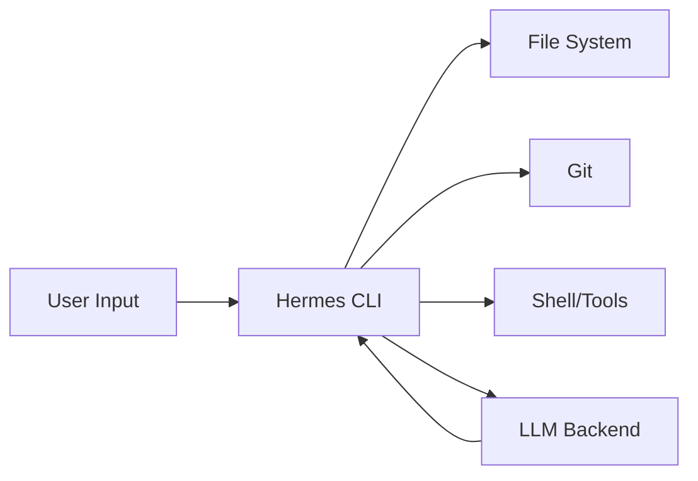

<picture>
  <source media="(prefers-color-scheme: dark)" srcset="../resources/logos/hermes-howto-logo-dark.svg">
  
</picture>

# Quickstart

Get Hermes Agent running in 15 minutes. This module covers installation, your first conversation, and essential configuration.

## Overview

Hermes Agent is an AI agent from Nous Research that runs in your terminal. It combines a powerful LLM with deep file system access, git integration, and tool execution to help you write, review, and refactor code.

## What You'll Learn

| Module | Topic | Time |
|--------|-------|------|
| [Installation](installation.md) | Install Hermes Agent | 5 min |
| [First Conversation](first-conversation.md) | Run your first prompt | 5 min |
| [Configuration](configuration.md) | Configure for your workflow | 5 min |

## Quick Comparison

| Feature | Manual Coding | Hermes Agent |
|---------|---------------|-------------|
| **Speed** | Write each line manually | Generate full functions |
| **Consistency** | Varies by developer | Follows project patterns |
| **Search** | `grep` + manual review | Ask and get context |
| **Debugging** | Add logs, trace manually | Explain the issue |
| **Documentation** | Often skipped | Generated inline |

## System Requirements

- **OS**: macOS 12+, Linux (Ubuntu 20.04+), Windows with WSL
- **Shell**: Bash, Zsh, Fish, or PowerShell
- **Network**: Internet connection for LLM access

## Next Steps

After completing this module, continue to [Memory](../02-memory/README.md) to learn about persistent context.

## Getting Help

If you encounter issues:

- Run `/doctor` in Hermes Agent to diagnose problems
- Run `/help` to see all available commands
- Visit [hermes-agent.nousresearch.com/docs](https://hermes-agent.nousresearch.com/docs) for full documentation
