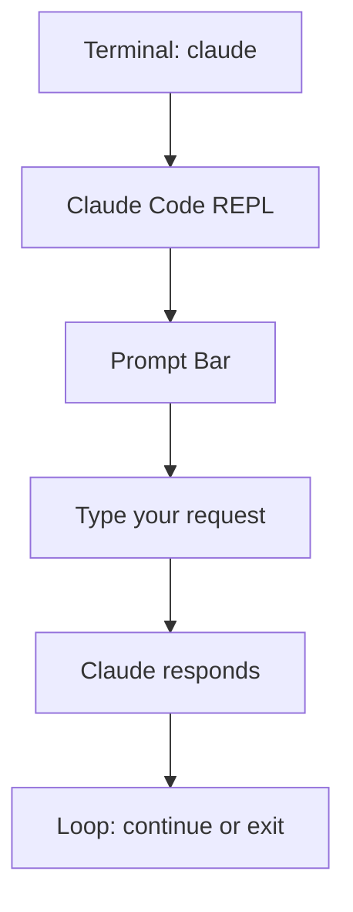
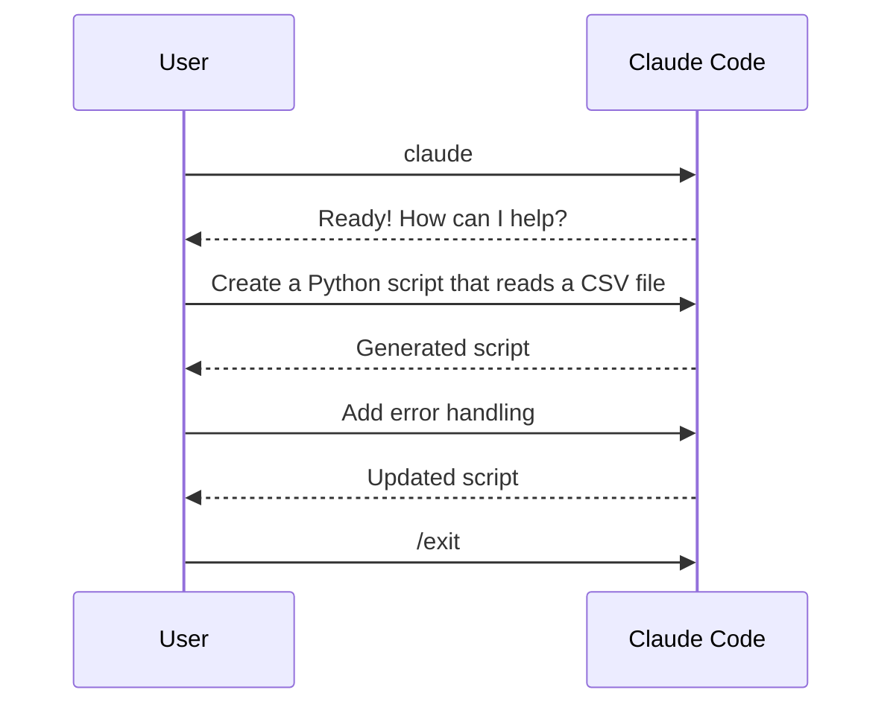

<picture>
  <source media="(prefers-color-scheme: dark)" srcset="../resources/logos/claude-howto-logo-dark.svg">
  
</picture>

# First Conversation

Run your first successful prompt with Claude Code in 5 minutes.

## Starting Claude Code

Open your terminal and type:

```bash
claude
```

This launches Claude Code in interactive REPL mode. You'll see the prompt bar at the bottom.



## Basic Commands

### Ask a question

```
How do I center a div in CSS?
```

Claude responds with a clear explanation and code examples.

### Generate code

```
Write a function that checks if a string is a palindrome
```

### Review code

```
Review my code in src/auth.ts
```

### Explain something

```
Explain what this regex does: ^\w+@[a-zA-Z_]+?\.[a-zA-Z]{2,3}$
```

## Conversation Modes

### Single prompt

```bash
claude "Write a hello world in Python"
```

### Interactive REPL

```bash
claude
# Then type multiple prompts
```

### Pipe input

```bash
echo "Explain this code" | claude --input src/utils.js
```

## Useful Slash Commands

While in REPL, use these built-in commands:

| Command | Description |
|---------|-------------|
| `/help` | Show all commands |
| `/clear` | Start a new conversation |
| `/model` | Switch AI model |
| `/exit` | Exit Claude Code |
| `/plan` | Enter plan mode |
| `/compact` | Reduce context |

## Example Workflow

Here's a typical first conversation:



### Step-by-step example

**1. Start Claude Code:**

```bash
claude
```

**2. Ask for a Python script:**

```
Create a Python script that reads a CSV file and prints the contents
```

**3. Get the response:**

Claude generates a complete script:

```python
import csv

def read_csv(filepath):
    with open(filepath, 'r') as f:
        reader = csv.DictReader(f)
        for row in reader:
            print(row)

if __name__ == "__main__":
    read_csv("data.csv")
```

**4. Save it:**

```
Save this to read_csv.py
```

**5. Ask for improvements:**

```
Add type hints and error handling
```

**6. Exit:**

```
/exit
```

## Claude Code vs Claude CLI

| Aspect | Claude Code | Claude CLI |
|--------|-------------|------------|
| Interface | Terminal REPL | Single prompt |
| Context | Remembers conversation | One-shot |
| Tools | Full access | Limited |
| Best for | Development | Quick questions |

## Tips for Effective Prompts

### Be specific

```
# Good
Create a React component for a login form with email and password fields

# Less good
Make a login form
```

### Provide context

```
# Good
Review src/auth.ts and suggest improvements for security

# Less good
Review my code
```

### Iterate

```
# First prompt
Write a function to sort a list

# Follow-up
Make it handle empty lists and add type hints
```

## Next Steps

- [Configuration](configuration.md) - Customize your setup
- [Slash Commands](../02-slash-commands/README.md) - Learn built-in shortcuts

## See Also

- [Memory](../02-memory/README.md) - Persistent context
- [Skills](../03-skills/README.md) - Automate tasks
