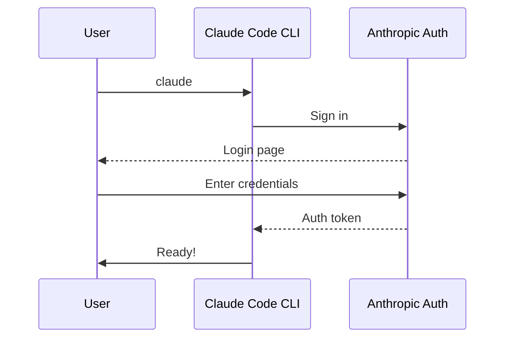

<picture>
  <source media="(prefers-color-scheme: dark)" srcset="../resources/logos/claude-howto-logo-dark.svg">
  
</picture>

# Installation

Install Claude Code on your system in under 5 minutes.

## Supported Platforms

| Platform | Status | Notes |
|----------|--------|-------|
| macOS 12+ | Fully supported | Native app or CLI |
| Linux (Ubuntu 20.04+) | Fully supported | CLI only |
| Windows (WSL) | Fully supported | Use WSL2 terminal |
| Windows (native) | Coming soon | Not yet available |

## Installation Methods

### macOS

**Option 1: Download from website**

1. Visit [code.claude.com](https://code.claude.com)
2. Click "Download for macOS"
3. Open the downloaded `.dmg` file
4. Drag Claude Code to your Applications folder

**Option 2: Homebrew**

```bash
brew install --cask claude
```

### Linux

**Option 1: Install script**

```bash
curl -sSL https://storage.googleapis.com/claude-code/claude.sh | sh
```

**Option 2: Manual install**

```bash
# Download the binary
curl -O https://storage.googleapis.com/claude-code/claude-linux-x86_64

# Make it executable
chmod +x claude-linux-x86_64

# Move to your PATH
sudo mv claude-linux-x86_64 /usr/local/bin/claude
```

### Windows (WSL)

If using WSL (Windows Subsystem for Linux), install Claude Code within your Linux environment using the Linux installation steps above.

> **Note**: Make sure you're running the install command inside WSL, not in PowerShell or CMD.

## Verification

After installation, verify Claude Code is working:

```bash
claude --version
```

You should see output like:

```
Claude Code v2.1.112
```

## First Launch

On first launch, you'll be prompted to:

1. **Sign in** - Authenticate with your Anthropic account
2. **Choose settings** - Select defaults for your workflow
3. **Grant permissions** - Allow file system and git access



## Authentication

Claude Code requires an Anthropic account. Free accounts get limited usage; Pro/Max plans offer higher limits.

| Plan | Monthly Usage | Features |
|------|---------------|----------|
| Free | Limited | Basic features |
| Pro | Higher limits | Full access |
| Max | Highest limits | Priority access |

### CLI Login

```bash
claude login
```

This opens a browser window for OAuth authentication.

## Troubleshooting

### "Command not found"

If `claude` is not found after installation:

```bash
# Add to your PATH (for manual installs)
export PATH="$PATH:/usr/local/bin"

# Or rehash your shell
hash -r
```

### Permission denied

```bash
# Make sure the binary is executable
chmod +x /usr/local/bin/claude
```

### Network issues

If you have connectivity problems:

1. Check your internet connection
2. Ensure firewall allows connections to `*.anthropic.com`
3. Try `claude login` again

### Run diagnostics

```bash
claude /doctor
```

This command checks your installation health and suggests fixes.

## Next Steps

Once installed, proceed to [First Conversation](first-conversation.md) to run your first prompt.

## See Also

- [Configuration](configuration.md) - Customize your setup
- [Slash Commands](../02-slash-commands/README.md) - Learn built-in shortcuts
