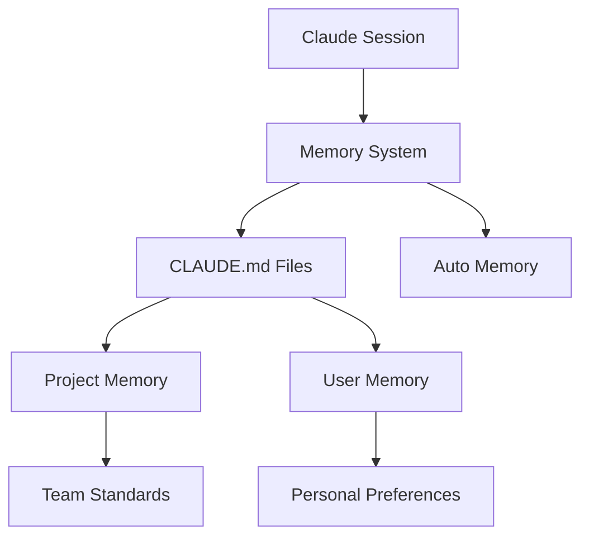

# Memory System

Persistent context management for Claude Code sessions.

## Overview

Memory enables Claude to retain context across sessions through filesystem-based CLAUDE.md files. Unlike temporary conversation context, memory files persist indefinitely and are shared across team members when committed to version control.

## Quick Reference

| Command | Purpose |
|---------|---------|
| `/init` | Initialize new CLAUDE.md with template |
| `/memory` | Edit memory files in system editor |

## Memory Types

| Type | Location | Scope |
|------|----------|-------|
| Managed Policy | System-wide (OS-specific) | Organization |
| Project Memory | `./CLAUDE.md` or `./.claude/CLAUDE.md` | Team |
| Project Rules | `./.claude/rules/*.md` | Team (modular) |
| User Memory | `~/.claude/CLAUDE.md` | Personal |
| Local Memory | `./CLAUDE.local.md` | Personal (git-ignored) |
| Auto Memory | `~/.claude/projects/<project>/memory/` | Automatic learnings |

## Files in This Module

- [memory-file.md](memory-file.md) - CLAUDE.md and MEMORY.md file formats
- [memory-tool.md](memory-tool.md) - /init and /memory commands
- [memory-providers.md](memory-providers.md) - Memory hierarchy and providers

## Architecture



## Quick Start

```bash
# Initialize project memory
claude /init

# Edit existing memory
claude /memory
```

## Example Usage

```markdown
# Ask Claude to remember something
Remember that we use TypeScript strict mode in this project.

# Claude prompts for memory location:
# 1. Project memory (./CLAUDE.md)
# 2. Personal memory (~/.claude/CLAUDE.md)
```
