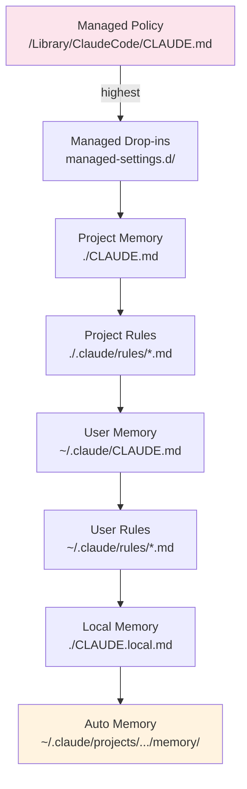

# Memory Providers

## Overview

Memory providers define where memory is stored and how it is loaded. Claude Code uses a hierarchical system with multiple provider levels, each serving different scopes.

## Memory Hierarchy

Memory files are loaded in precedence order (highest to lowest):



## Provider Locations

### Managed Policy (Highest Priority)

| Platform | Location |
|----------|----------|
| macOS | `/Library/Application Support/ClaudeCode/CLAUDE.md` |
| Linux/WSL | `/etc/claude-code/CLAUDE.md` |
| Windows | `C:\Program Files\ClaudeCode\CLAUDE.md` |

Purpose: Organization-wide policies and security standards.

### Managed Drop-ins (v2.1.83+)

Location: Alongside managed policy in `managed-settings.d/` directory

Files are merged alphabetically. Enables modular policy management.

### Project Memory

| Location | Scope |
|----------|-------|
| `./CLAUDE.md` | Project root |
| `./.claude/CLAUDE.md` | Alternative project location |

Purpose: Team-shared context, committed to git.

### Project Rules

Location: `./.claude/rules/*.md` (recursive subdirectories supported)

Purpose: Modular, topic-specific project instructions.

### User Memory

Location: `~/.claude/CLAUDE.md`

Purpose: Personal preferences across all projects.

### User Rules

Location: `~/.claude/rules/*.md`

Purpose: Personal rules for all projects.

### Local Project Memory

Location: `./CLAUDE.local.md`

Purpose: Personal project-specific preferences (git-ignored).

### Auto Memory (Lowest Priority)

Location: `~/.claude/projects/<project>/memory/`

Purpose: Claude's automatic notes and learnings during sessions.

## Settings File Hierarchy

Memory-related settings (`autoMemoryDirectory`, `claudeMdExcludes`) follow this precedence:

| Level | Location | Scope |
|-------|----------|-------|
| 1 (highest) | Managed policy | Organization |
| 2 | `managed-settings.d/` | Modular policy |
| 3 | `~/.claude/settings.json` | User |
| 4 | `.claude/settings.json` | Project (git-tracked) |
| 5 (lowest) | `.claude/settings.local.json` | Local overrides |

## claudeMdExcludes

Exclude irrelevant CLAUDE.md files in large monorepos:

```json
{
  "claudeMdExcludes": [
    "packages/legacy-app/CLAUDE.md",
    "vendors/**/CLAUDE.md"
  ]
}
```

## autoMemoryDirectory

Customize auto memory location:

```json
{
  "autoMemoryDirectory": "/path/to/custom/memory"
}
```

> Note: Only configurable in user or local settings.

## Loading Behavior

### Startup Loading

- All CLAUDE.md files loaded automatically at session start
- Earlier in hierarchy = higher precedence
- Auto memory loads first 200 lines / 25KB of MEMORY.md

### Context During Session

- Subdirectory CLAUDE.md loaded when accessing those directories
- Topic-specific auto memory files loaded on demand

### Worktree Behavior

All worktrees in same git repository share one auto memory directory.

## Subagent Memory

Subagents can be configured to load specific memory scopes:

```yaml
memory: user      # User-level only
memory: project   # Project-level only
memory: local     # Local memory only
```

## Comparison Table

| Provider | Scope | Shared | Priority | Version Control |
|----------|-------|--------|----------|----------------|
| Managed Policy | Organization | Yes | 1 | No |
| Managed Drop-ins | Organization | Yes | 2 | No |
| Project Memory | Team | Yes | 3 | Yes |
| Project Rules | Team | Yes | 4 | Yes |
| User Memory | Personal | No | 5 | No |
| User Rules | Personal | No | 6 | No |
| Local Memory | Personal | No | 7 | No |
| Auto Memory | Personal | No | 8 | No |
