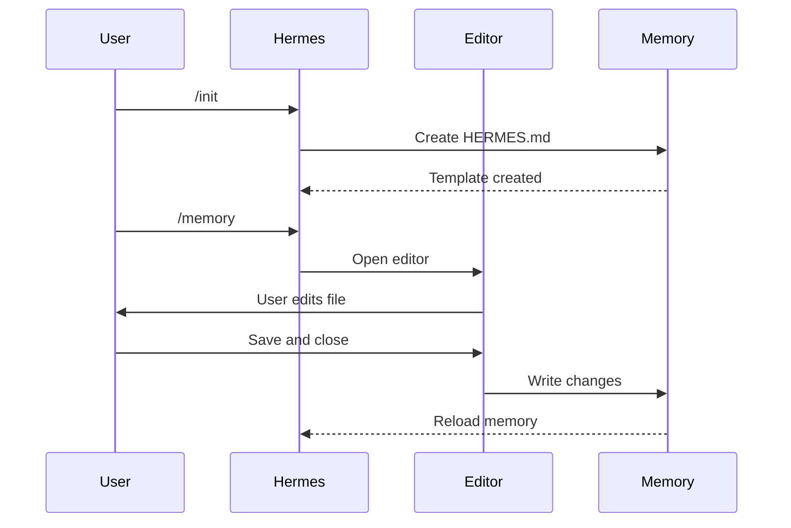

# Memory Tools

## Overview

Two main commands manage memory in Hermes Agent: `/init` for creating new HERMES.md files, and `/memory` for editing existing ones.

## /init Command

Initialize a new HERMES.md file with a starter template.

### Usage

```bash
/init
```

### Enhanced Mode

Set `CLAUDE_CODE_NEW_INIT=1` for interactive setup:

```bash
CLAUDE_CODE_NEW_INIT=1 hermes
/init
```

### What It Does

1. Creates `./HERMES.md` or `./.hermes/HERMES.md`
2. Populates with project template sections
3. Establishes foundation for context persistence

### When to Use

- Starting a new project
- First-time HERMES.md setup
- Establishing team standards
- Setting up memory hierarchy

### Example Output

```markdown
# Project Configuration

## Project Overview
- Name: Your Project
- Tech Stack: [Your technologies]
- Team Size: [Number of developers]

## Development Standards
- Code style preferences
- Testing requirements
- Git workflow conventions
```

## /memory Command

Edit existing memory files in your system editor.

### Usage

```bash
/memory
```

### What It Does

1. Opens memory file selection menu
2. Allows choosing which memory file to edit
3. Opens selected file in system editor
4. Reloads updated memory after editing

### Selection Options

```
1. Managed Policy Memory
2. Project Memory (./HERMES.md)
3. User Memory (~/.hermes/HERMES.md)
4. Local Project Memory
```

### When to Use

- Reviewing existing memory content
- Making extensive updates
- Reorganizing memory structure
- Adding detailed documentation

## /init vs /memory

| Aspect | /init | /memory |
|--------|-------|---------|
| Purpose | Create new HERMES.md | Edit existing memory |
| Action | Generates template | Opens editor |
| When | New projects | Ongoing maintenance |
| Workflow | One-time setup | Iterative updates |

## Adding Memory During Conversation

### Method 1: Ask Conversationally

```markdown
Remember that we use TypeScript strict mode.
Please add to memory: prefer async/await over promises.
```

### Method 2: Direct File Reference

```markdown
# Add to ./HERMES.md:
- Always validate input with Zod schemas
```

Hermes will prompt you to confirm which memory file to update.

## Quick Memory Patterns

### Single Rule Addition

```markdown
User: Remember that I prefer 2-space indentation
Hermes: I'll add this to your memory. Which file?
User: Project memory
Hermes: ✅ Saved to ./HERMES.md
```

### Multiple Rules Addition

```markdown
User: # new rule into memory
      Always validate user input with Zod before processing.
Hermes: Which memory file?
User: Project memory
Hermes: ✅ Added to ./HERMES.md
```

## Environment Variables

| Variable | Purpose |
|----------|---------|
| `CLAUDE_CODE_NEW_INIT=1` | Enable interactive init mode |
| `CLAUDE_CODE_DISABLE_AUTO_MEMORY=0` | Force auto memory on |
| `CLAUDE_CODE_DISABLE_AUTO_MEMORY=1` | Force auto memory off |

## Flow Diagram


