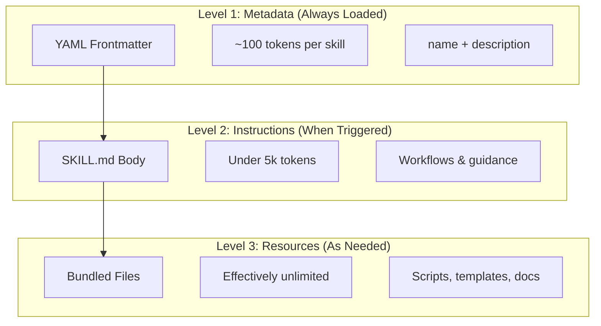
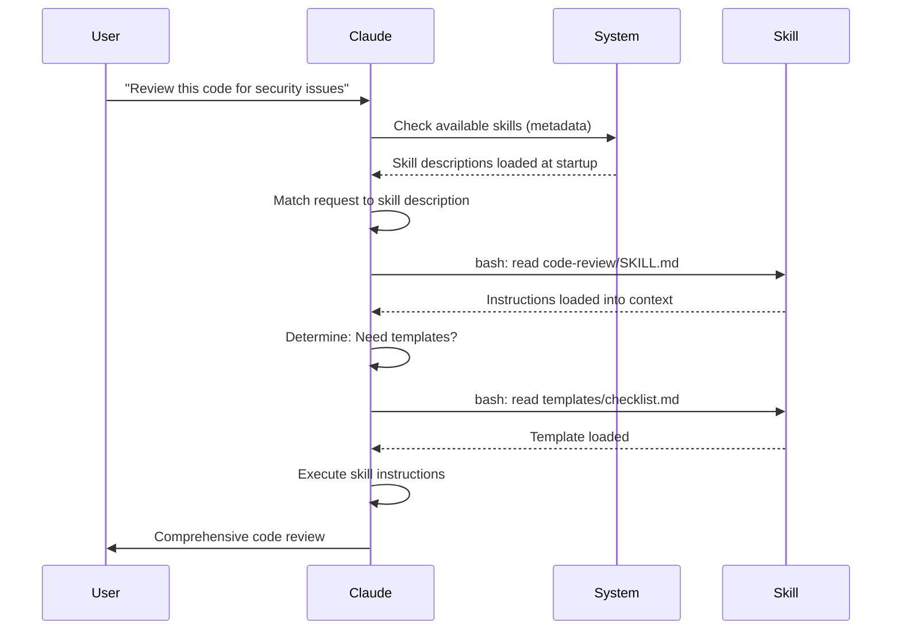

<picture>
  <source media="(prefers-color-scheme: dark)" srcset="../resources/logos/claude-howto-logo-dark.svg">
  
</picture>

# Skill Lifecycle

Skills leverage a **progressive disclosure** architecture—Claude loads information in stages as needed. This enables efficient context management while maintaining unlimited scalability.

## Progressive Disclosure

### Three Levels of Loading



| Level | When Loaded | Token Cost | Content |
|-------|------------|------------|---------|
| **Level 1: Metadata** | Always (at startup) | ~100 tokens per Skill | `name` and `description` from YAML frontmatter |
| **Level 2: Instructions** | When Skill is triggered | Under 5k tokens | SKILL.md body with instructions and guidance |
| **Level 3+: Resources** | As needed | Effectively unlimited | Bundled files executed via bash without loading into context |

This means you can install many Skills without context penalty—Claude only knows each Skill exists and when to use it until actually triggered.

## Skill Loading Process



## Controlling Skill Invocation

By default, both you and Claude can invoke any skill. Two frontmatter fields control invocation:

| Frontmatter | You can invoke | Claude can invoke |
|-------------|-----------------|-------------------|
| (default) | Yes | Yes |
| `disable-model-invocation: true` | Yes | No |
| `user-invocable: false` | No | Yes |

**Use `disable-model-invocation: true`** for workflows with side effects: `/commit`, `/deploy`, `/send-slack-message`. You don't want Claude deciding to deploy because your code looks ready.

**Use `user-invocable: false`** for background knowledge that isn't actionable as a command. A `legacy-system-context` skill explains how an old system works—useful for Claude, but not a meaningful action for users.

## Skill Discovery

### Automatic Discovery

**Nested directories**: When you work with files in subdirectories, Claude Code automatically discovers skills from nested `.claude/skills/` directories. For example, if you're editing `packages/frontend/`, Claude also looks for skills in `packages/frontend/.claude/skills/`.

**`--add-dir` directories**: Skills from directories added via `--add-dir` are loaded automatically with live change detection.

### Description Budget

Skill descriptions (Level 1 metadata) are capped at **1% of the context window** (fallback: **8,000 characters**). If you have many skills installed, descriptions may be shortened. Override with `SLASH_COMMAND_TOOL_CHAR_BUDGET` environment variable.

## Running Skills in Subagents

Add `context: fork` to run a skill in an isolated subagent context with its own context window.

The `agent` field specifies which agent type:

| Agent Type | Best For |
|------------|----------|
| `Explore` | Read-only research, codebase analysis |
| `Plan` | Creating implementation plans |
| `general-purpose` | Broad tasks requiring all tools |

```yaml
---
context: fork
agent: Explore
---
```

## Managing Skills

### Viewing Available Skills

Ask Claude directly:
```
What Skills are available?
```

Or check the filesystem:
```bash
# List personal Skills
ls ~/.claude/skills/

# List project Skills
ls .claude/skills/
```

### Testing a Skill

**Let Claude invoke it automatically** by asking something that matches the description:
```
Can you help me review this code for security issues?
```

**Or invoke it directly** with the skill name:
```
/code-review src/auth/login.ts
```

### Updating a Skill

Edit the `SKILL.md` file directly. Changes take effect on next Claude Code startup.

```bash
# Personal Skill
code ~/.claude/skills/my-skill/SKILL.md

# Project Skill
code .claude/skills/my-skill/SKILL.md
```

## Restricting Claude's Skill Access

**Disable all skills** in `/permissions`:
```
# Add to deny rules:
Skill
```

**Allow or deny specific skills**:
```
# Allow only specific skills
Skill(commit)
Skill(review-pr *)

# Deny specific skills
Skill(deploy *)
```

## Troubleshooting

### Skill Not Triggering

If Claude doesn't use your skill when expected:

1. Check the description includes keywords users would naturally say
2. Verify the skill appears when asking "What skills are available?"
3. Try rephrasing your request to match the description
4. Invoke directly with `/skill-name` to test

### Skill Triggers Too Often

If Claude uses your skill when you don't want it:

1. Make the description more specific
2. Add `disable-model-invocation: true` for manual-only invocation

### Claude Doesn't See All Skills

Skill descriptions are loaded at **1% of the context window** (fallback: **8,000 characters**). Run `/context` to check for warnings about excluded skills.

## Security Considerations

**Only use Skills from trusted sources.** Skills provide Claude with capabilities through instructions and code—a malicious Skill can direct Claude to invoke tools or execute code in harmful ways.

- **Audit thoroughly**: Review all files in the Skill directory
- **External sources are risky**: Skills that fetch from external URLs can be compromised
- **Tool misuse**: Malicious Skills can invoke tools in harmful ways
- **Treat like installing software**: Only use Skills from trusted sources
