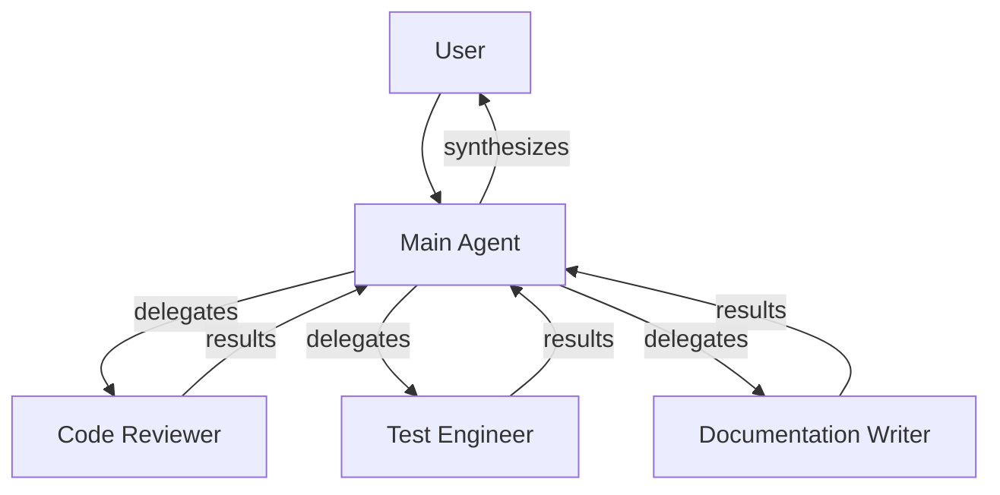
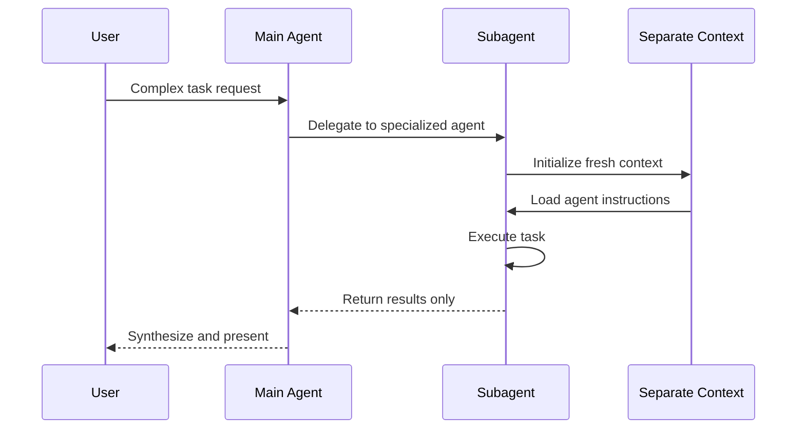

<picture>
  <source media="(prefers-color-scheme: dark)" srcset="../resources/logos/hermes-howto-logo-dark.svg">
  
</picture>

# Delegation & Subagents

Delegation is Hermes's core unique feature — the ability to create specialized subagents that work in parallel on focused tasks with their own context windows.

## Overview

Delegation enables you to:

- Create **specialized AI assistants** with specific roles and tool access
- Run **parallel execution** where multiple subagents work simultaneously
- Maintain **clean context separation** between different task types
- Scale complex work across **multiple specialized agents**



## What You'll Learn

|| Topic | Description |
||-------|-------------|
|| [delegate-task.md](delegate-task.md) | The delegate_task tool for spawning subagents |
|| [when-to-delegate.md](when-to-delegate.md) | Decision guide for when delegation makes sense |
|| [delegation-examples/](delegation-examples/) | Ready-to-use agent configurations |

## Key Concepts

### Subagent vs Main Agent

|| Aspect | Main Agent | Subagent |
|--------|------------|----------|
| **Context** | Full conversation history | Clean slate per task |
| **Tools** | All available tools | Restricted by configuration |
| **Spawning** | Can spawn subagents | Cannot spawn others |
| **Purpose** | Coordination, synthesis | Focused task execution |

### Delegation Architecture



## Quick Start

### Basic Delegation

```
Use the code-reviewer subagent to review recent changes
```

### Parallel Delegation

```
Use the code-reviewer, test-engineer, and documentation-writer subagents
to review code, write tests, and update docs in parallel
```

### Resume a Subagent

```
Resume agent abc123 to continue the analysis
```

## Built-in Subagents

|| Agent | Purpose |
||-------|---------|
| **general-purpose** | Complex multi-step tasks |
| **Plan** | Research for plan mode |
| **Explore** | Read-only codebase exploration |
| **Bash** | Terminal commands in isolated context |

## File Locations

|| Type | Location | Scope |
||------|---------|-------|
| **Project agents** | `.claude/agents/` | Current project |
| **User agents** | `~/.claude/agents/` | All projects |

## Next Steps

- [delegate-task.md](delegate-task.md) — Tool reference for spawning agents
- [when-to-delegate.md](when-to-delegate.md) — Decision framework
- [delegation-examples/](delegation-examples/) — Example agent configurations
