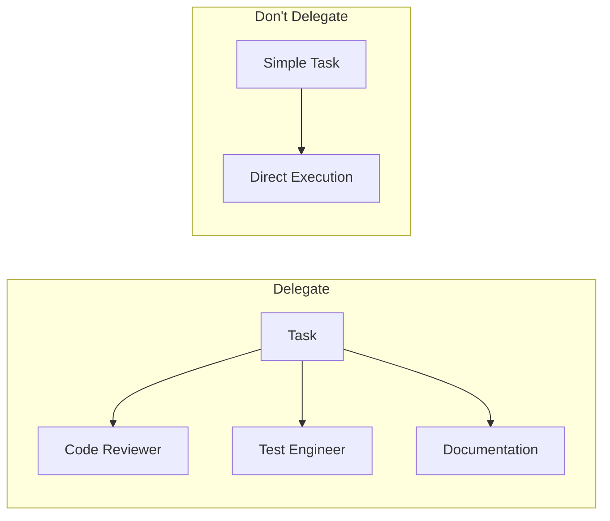

<picture>
  <source media="(prefers-color-scheme: dark)" srcset="../resources/logos/hermes-howto-logo-dark.svg">
  
</picture>

# When to Delegate

Decision framework for using delegation effectively.

## Quick Decision Guide

```
Is the task complex with multiple distinct concerns?
├── YES → Delegate to specialized agents
└── NO → Is it a single, well-defined task?
    ├── YES → Consider direct execution
    └── NO → Delegate for better context isolation
```

## Use Delegation When

### 1. Parallel Execution Benefits

|| Scenario | Why Delegate |
||----------|--------------|
| Multiple independent tasks | Run simultaneously |
| Different expertise needed | Specialized agents |
| Large codebase sections | Divide and conquer |
| Time-sensitive work | Parallel processing |

### 2. Context Isolation Needed

|| Scenario | Why Delegate |
||----------|--------------|
| Long-running analysis | Prevents context exhaustion |
| Experimental changes | Sandbox in worktree |
| Security audits | Minimal tool access |
| Different focus areas | Clean context per task |

### 3. Specialized Expertise

Create agents for specific roles:

- **Code reviewer** — Security and quality focus
- **Test engineer** — Coverage and edge cases
- **Documentation writer** — Clear explanations
- **Debugger** — Root cause analysis

## Do Not Delegate When

### 1. Simple Single Tasks

```
# Don't delegate this
delegate_task("What time is it?")

# Do directly
Just ask or check yourself
```

### 2. Context-Rich Conversations

```
# Don't delegate - context is critical
"Based on our previous discussion about architecture..."

# Continue in main agent
The main agent has the context
```

### 3. Quick Questions

```
# Don't delegate
delegate_task("What does this function do?")

# Do directly
Use /explain or ask in main agent
```

## Decision Matrix

|| Factor | Delegate | Don't Delegate |
||--------|----------|----------------|
| **Complexity** | Multi-step | Single step |
| **Independence** | Can run parallel | Sequential dependency |
| **Expertise** | Specialized needed | General knowledge |
| **Duration** | Long-running | Quick task |
| **Context** | Fresh context helpful | Context is critical |
| **Tools** | Restricted needed | Full access needed |

## Architecture Pattern



## Examples

### Good Delegation

```
# Review, test, and document in parallel
delegate_task("Review the new API endpoints", "code-reviewer")
delegate_task("Write integration tests for the API", "test-engineer")
delegate_task("Document the new endpoints", "documentation-writer")
```

### Poor Delegation

```
# Don't delegate simple tasks
delegate_task("Create a file called hello.txt with 'Hello World'")

# Don't delegate context-dependent work
delegate_task("Continue refactoring based on our earlier discussion...")
```

## Anti-Patterns

|| Anti-Pattern | Problem | Better Approach |
||---------------|---------|------------------|
| Over-delegation | Too many agents, coordination overhead | Consolidate to fewer agents |
| Under-delegation | Main agent does everything | Identify specialized needs |
| Chatty delegation | Excessive back-and-forth | Use resumable agents for long work |
| Unequal workloads | One agent overwhelmed | Balance task distribution |

## Best Practices

1. **Start simple** — Begin with main agent, delegate when complexity warrants
2. **Single responsibility** — Each agent has one clear purpose
3. **Restrict tools** — Only grant tools the agent needs
4. **Clear prompts** — Provide specific, actionable task descriptions
5. **Parallel when independent** — Use parallel delegation for independent tasks

## Next Steps

- [delegate-task.md](delegate-task.md) — Tool reference
- [delegation-examples/](delegation-examples/) — Ready-to-use agents
