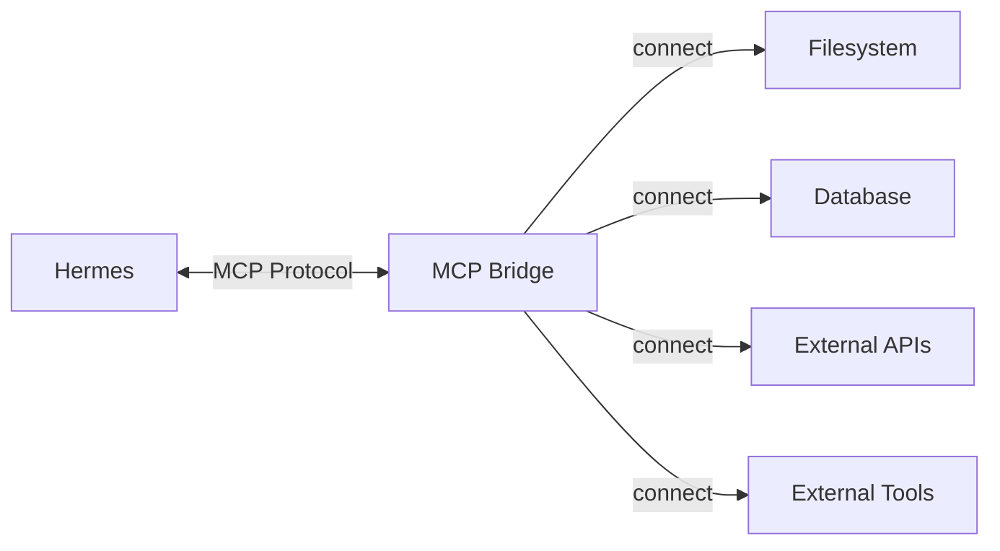

<picture>
  <source media="(prefers-color-scheme: dark)" srcset="../resources/logos/hermes-howto-logo-dark.svg">
  
</picture>

# MCP Integration

The Model Context Protocol (MCP) enables Hermes to connect with external tools, data sources, and services through a standardized interface.

## Overview

MCP provides:

- **Tool Integration** — Connect to external tools and services
- **Data Access** — Read from databases, APIs, and file systems
- **Standardized Protocol** — Consistent interface across different services
- **Hot Reload** — Update server configurations without restart



## What You'll Learn

| | Topic | Description |
|---|-------|-------------|
| | [mcp-quickstart.md](mcp-quickstart.md) | Getting started with MCP servers |
| | [mcp-servers.md](mcp-servers.md) | Server configuration and management |
| | [mcp-filtering.md](mcp-filtering.md) | Controlling which tools are available |
| | [mcp-examples/](mcp-examples/) | Ready-to-use server configurations |

## Key Concepts

### MCP Architecture

| Component | Role |
|-----------|------|
| **MCP Bridge** | Handles protocol translation between Hermes and servers |
| **MCP Server** | Implements the MCP protocol for a specific service |
| **Tool** | Individual function exposed by an MCP server |
| **Resource** | Data source accessible via MCP |

### Server Types

| Type | Use Case | Examples |
|------|----------|----------|
| **Filesystem** | Local file operations | Read, write, search files |
| **Database** | Query external databases | PostgreSQL, SQLite |
| **API** | External service integration | GitHub, Slack, custom APIs |
| **Tool** | Specialized external tools | Docker, kubectl, cloud CLIs |

## Quick Start

### Add a Server

```
Add the filesystem MCP server to enable file operations
```

### List Available Tools

```
Show me all MCP tools currently available
```

### Filter Tools

```
Only allow read-only filesystem tools from the filesystem server
```

## Server Management

| Task | Command |
|------|---------|
| Add server | `mcp add <name> <command> [args]` |
| Remove server | `mcp remove <name>` |
| List servers | `mcp list` |
| Start server | `mcp start <name>` |
| Stop server | `mcp stop <name>` |

## File Locations

| Type | Location | Scope |
|------|---------|-------|
| **Project servers** | `.claude/mcp_servers/` | Current project |
| **User servers** | `~/.claude/mcp_servers/` | All projects |

## Verify Your Understanding

1. Run `/lesson-quiz mcp` to test your knowledge
2. Review areas needing reinforcement
3. Proceed to next module

## Next Steps

- [mcp-quickstart.md](mcp-quickstart.md) — Setup your first MCP server
- [mcp-servers.md](mcp-servers.md) — Configure and manage servers
- [mcp-filtering.md](mcp-filtering.md) — Control tool access
- [mcp-examples/](mcp-examples/) — Example configurations
