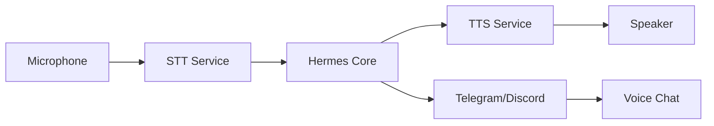

<picture>
  <source media="(prefers-color-scheme: dark)" srcset="../resources/logos/hermes-howto-logo-dark.svg">
  
</picture>

# Voice Mode

Real-time voice interaction with Hermes — speak naturally and hear responses spoken aloud.

## Overview

Voice Mode transforms Hermes into a spoken dialogue partner. It combines speech-to-text for input and text-to-speech for output, enabling hands-free interaction while you code, work, or multitask.

### Key Benefits

- **Hands-free operation**: Keep typing to a minimum while maintaining full capability
- **Natural dialogue**: Conversational back-and-forth without the friction of text
- **Accessibility**: Voice input/output for users who prefer or require speech interaction
- **Multitasking**: Interact while your hands are occupied with other tasks

## What You'll Learn

| | Module | Topic |
|-|--------|-------|
| | [voice-setup.md](voice-setup.md) | Configure audio devices and backends |
| | [voice-cli.md](voice-cli.md) | Voice interaction from the command line |
| | [voice-telegram.md](voice-telegram.md) | Voice through Telegram bot integration |
| | [voice-discord.md](voice-discord.md) | Voice through Discord bot integration |

## Quick Comparison

| Feature | Text Mode | Voice Mode |
|---------|-----------|------------|
| **Input** | Keyboard typing | Microphone speech |
| **Output** | Terminal text | Synthesized speech |
| **Latency** | Instant display | Processing + TTS delay |
| **Best For** | Precise editing, writing | Quick questions, brainstorming |
| **Accessibility** | Visual interface | Audio interface |

## System Requirements

- **Microphone**: Working microphone for voice input
- **Speaker/Audio Output**: Speakers or headphones for voice output
- **Network**: Internet connection for STT/TTS processing

## Architecture

## Setup Options

| Method | Description | Latency | Quality |
|--------|-------------|---------|---------|
| **CLI** | Direct voice in terminal | Low | Depends on backend |
| **Telegram** | Voice through Telegram bot | Medium | High |
| **Discord** | Voice through Discord bot | Medium | High |

## Verify Your Understanding

1. Run `/lesson-quiz voice` to test your knowledge
2. Review areas needing reinforcement
3. Proceed to next module

## Next Steps

- [voice-setup.md](voice-setup.md) — Configure your audio environment
- [voice-cli.md](voice-cli.md) — Start voice interaction from CLI
- [voice-telegram.md](voice-telegram.md) — Enable voice via Telegram
- [voice-discord.md](voice-discord.md) — Enable voice via Discord

## Getting Help

If you encounter issues:

- Check your microphone is set as the default input device
- Verify audio output device is configured correctly
- Ensure network connectivity for STT/TTS services
- Consult the [Hermes documentation](https://docs.hermes.com) for platform-specific issues
