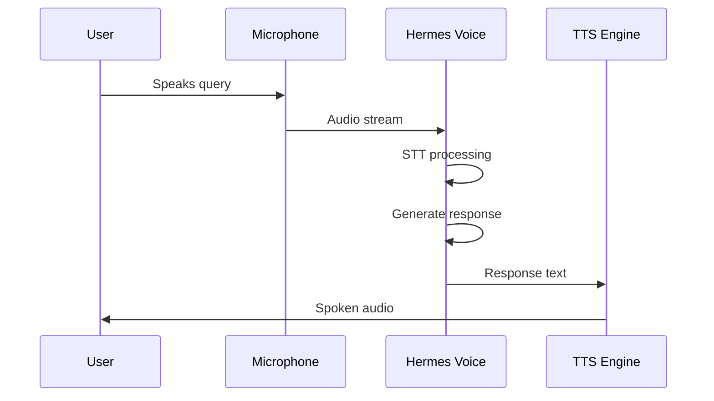

<picture>
  <source media="(prefers-color-scheme: dark)" srcset="../resources/logos/hermes-howto-logo-dark.svg">
  
</picture>

# Voice CLI

Voice interaction directly from the command line with Hermes.

## Overview

The CLI voice mode provides direct voice input/output through your terminal. Speak your queries and hear responses spoken back without switching to external applications.

## Starting Voice Mode

### Basic Start

```bash
hermes voice
```

This starts Hermes in voice mode with default settings:
- Listens for speech input
- Processes through Hermes
- Speaks response aloud

### With Options

```bash
# Specify backend explicitly
hermes voice --backend openai

# Set language
hermes voice --lang en

# Start with specific voice
hermes voice --voice "alloy"
```

## Voice Commands

While in voice mode, you can use voice commands:

| Command | Description |
|---------|-------------|
| "exit" or "quit" | End voice session |
| "help" | List available voice commands |
| "mute" | Disable audio output |
| "unmute" | Enable audio output |
| "repeat" | Repeat last response |
| "pause" | Pause listening |
| "resume" | Resume listening |

## Interaction Flow



## Continuous Mode

Enable continuous listening for multi-turn conversations:

```bash
hermes voice --continuous
```

In continuous mode:
- Hermes listens after each response
- Speak naturally without pressing any keys
- Say "exit" to end session

## Push-to-Talk Mode

For environments where continuous listening causes issues:

```bash
hermes voice --ptt
```

With push-to-talk:
- Press and hold spacebar to speak
- Release to process and hear response
- Useful in noisy environments

## Voice Profile

Save your voice preferences:

```bash
# Save current settings as profile
hermes voice --save-profile default

# Load specific profile
hermes voice --profile default
```

## Output Options

### Text Only Mode

Disable speech output, show text only:

```bash
hermes voice --text-only
```

### Audio Only Mode

Disable text display, audio only:

```bash
hermes voice --audio-only
```

### Adjust Speech Rate

```bash
# 0.5 = half speed, 1.0 = normal, 2.0 = double speed
hermes voice --speech-rate 1.2
```

### Adjust Volume

```bash
# 0.0 = mute, 1.0 = normal volume
hermes voice --volume 0.8
```

## Keyboard Shortcuts

| Key | Action |
|-----|--------|
| `Ctrl+C` | Interrupt current response |
| `Ctrl+D` | End voice session |
| `Space` | Push-to-talk (in PTT mode) |
| `M` | Toggle mute |
| `R` | Repeat last response |

## Session Examples

### Quick Question

```
$ hermes voice
Listening... (say 'exit' to quit)

You: "What's the weather today?"
Hermes: "I don't have access to real-time weather data,
         but I can help you check if you have weather
         configuration set up."
[Audio: Spoken response]

You: "exit"
Session ended.
```

### Code Review Session

```
$ hermes voice --continuous
Listening continuously...

You: "Review the changes I made to auth.py"
Hermes: "I see you modified the authentication module.
         The main changes are:
         - Added rate limiting to the login endpoint
         - Implemented token refresh logic
         - Added MFA support"
[Audio: Spoken summary]

You: "Any security concerns?"
Hermes: "Your implementation looks solid. One suggestion:
         consider adding CSRF protection to the token
         refresh endpoint."
[Audio: Spoken response]
```

## Troubleshooting

### Not Hearing Responses

1. Check audio output device is set correctly
2. Verify volume is not muted
3. Run speaker test:
   ```bash
   speaker-test -t sine
   ```

### Responses Delayed

- Switch to local TTS backend for faster output
- Check network latency if using cloud backend

### Voice Not Detected

1. Verify microphone is set as default input
2. Check microphone is not muted
3. Try speaking louder or closer to microphone
4. Run audio test:
   ```bash
   arecord -d 3 test.wav && aplay test.wav
   ```

## Next Steps

- [voice-setup.md](voice-setup.md) — Configure audio backends
- [voice-telegram.md](voice-telegram.md) — Voice via Telegram
- [voice-discord.md](voice-discord.md) — Voice via Discord
