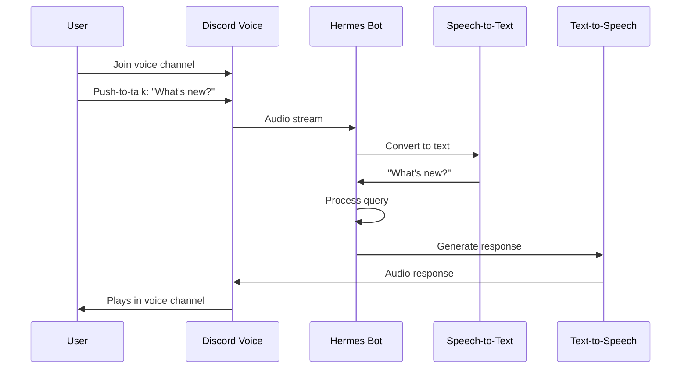

<picture>
  <source media="(prefers-color-scheme: dark)" srcset="../resources/logos/hermes-howto-logo-dark.svg">
  
</picture>

# Voice via Discord

Interact with Hermes using voice channels in Discord.

## Overview

Discord voice integration lets you have spoken conversations with Hermes in Discord voice channels. Join a voice channel, press the push-to-talk key, and talk to Hermes directly.

## Prerequisites

- A Discord account
- A Discord application with bot token
- Hermes with Discord integration configured
- Discord bot added to your server

## Setup

### 1. Create a Discord Application

1. Go to [Discord Developer Portal](https://discord.com/developers/applications)
2. Click **New Application**
3. Name your application
4. Go to **Bot** section
5. Click **Reset Token** and copy the token
6. Enable **Message Content Intent** under Privileged Gateway Intents

### 2. Configure Hermes

```bash
# Set Discord bot token
export HERMES_DISCORD_TOKEN="your-bot-token"

# Or in config file
# ~/.hermes/config.yaml
discord:
  enabled: true
  token: "your-bot-token"
  voice_mode: true
```

### 3. Add Bot to Server

1. Go to **OAuth2** > **URL Generator**
2. Select scopes: `bot` and `applications.commands`
3. Select permissions:
   - Send Messages
   - Read Message History
   - Connect (voice)
   - Speak (voice)
4. Copy generated URL
5. Open URL and add bot to your server

### 4. Start Hermes with Discord

```bash
hermes --discord
```

## Using Voice Mode

### Join a Voice Channel

1. Open Discord and join any voice channel
2. The bot will show as connected alongside you

### Push-to-Talk

**Default keybind**: `Ctrl+\`` (configurable)

1. Press and hold your PTT key
2. Speak your query
3. Release to send

Hermes will:
- Convert speech to text
- Process the query
- Respond in the same voice channel

### Automatic Voice Detection

Enable automatic voice detection to avoid keybinds:

```yaml
discord:
  voice_mode: true
  vad_enabled: true  # Voice activity detection
  vad_threshold: 0.3
```

With VAD enabled:
- Simply speak to trigger processing
- Hermes detects when you stop speaking
- Response plays in voice channel

## Conversation Flow



## Commands

In text channels or with slash commands:

| Command | Description |
|---------|-------------|
| `/join` | Join user's voice channel |
| `/leave` | Leave current voice channel |
| `/voice` | Toggle voice mode on/off |
| `/ptt` | Set push-to-talk key |
| `/vad` | Toggle voice activity detection |

## Voice Settings

| Setting | Description | Default |
|---------|-------------|---------|
| `voice_mode` | Enable voice processing | true |
| `ptt_key` | Push-to-talk key | "ctrl+`" |
| `vad_enabled` | Voice activity detection | false |
| `vad_threshold` | VAD sensitivity | 0.5 |
| `voice_language` | Language for STT | "en" |
| `deafen_bot` | Bot deafens itself | true |

## Text Fallback

When voice isn't convenient:

- Send a text message in any channel
- Hermes responds with text
- Useful for longer queries or code snippets

## Configuration Examples

### Basic Configuration

```yaml
discord:
  enabled: true
  token: "your-bot-token"
  voice_mode: true
```

### With VAD Enabled

```yaml
discord:
  enabled: true
  token: "your-bot-token"
  voice_mode: true
  vad_enabled: true
  vad_threshold: 0.4
```

### Custom PTT Key

```yaml
discord:
  enabled: true
  token: "your-bot-token"
  voice_mode: true
  ptt_key: "capslock"
```

### Single Server Setup

```yaml
discord:
  enabled: true
  token: "your-bot-token"
  allowed_guilds:
    - 123456789012345678  # Your server ID
```

## Troubleshooting

### Bot Won't Join Voice Channel

1. Verify bot token is correct
2. Ensure bot has **Connect** and **Speak** permissions
3. Check the bot isn't already in a voice channel
4. Verify `voice_mode: true` in config

### PTT Not Working

1. Check keybind doesn't conflict with other apps
2. Verify bot has **Speak** permission
3. Try resetting keybind:
   ```
   /ptt reset
   ```

### VAD Not Detecting Speech

1. Increase `vad_threshold` (0.6-0.8 for noisier environments)
2. Decrease for quieter environments (0.2-0.4)
3. Ensure microphone gain is not too low

### Audio Cuts Out

1. Check network latency to Discord server
2. Verify bot has sufficient bandwidth
3. Reduce audio quality if needed:
   ```yaml
   discord:
     audio_quality: "low"  # "medium" or "high"
   ```

### Bot Hears Everyone

With VAD enabled, bot may pick up other speakers:

1. Set `deafen_bot: true` (bot won't hear others)
2. Use PTT mode instead of VAD
3. Use in smaller voice channels only

## Advanced Configuration

### Audio Quality

```yaml
discord:
  voice_mode: true
  audio_quality: "high"  # low/medium/high
  sample_rate: 48000
```

### Text-to-Speech Voice

```yaml
discord:
  voice_mode: true
  tts_voice: "alloy"  # OpenAI voice
  speech_rate: 1.0
  volume: 1.0
```

### Multiple Servers

```yaml
discord:
  enabled: true
  token: "your-bot-token"
  allowed_guilds:
    - 123456789012345678
    - 987654321098765432
```

## Security Considerations

- Bot only processes speech when explicitly configured
- VAD processes audio locally before sending
- No speech data is stored persistently
- Use permissions to control bot access

## Next Steps

- [voice-setup.md](voice-setup.md) — Configure audio backends
- [voice-cli.md](voice-cli.md) — CLI voice interaction
- [voice-telegram.md](voice-telegram.md) — Voice via Telegram
