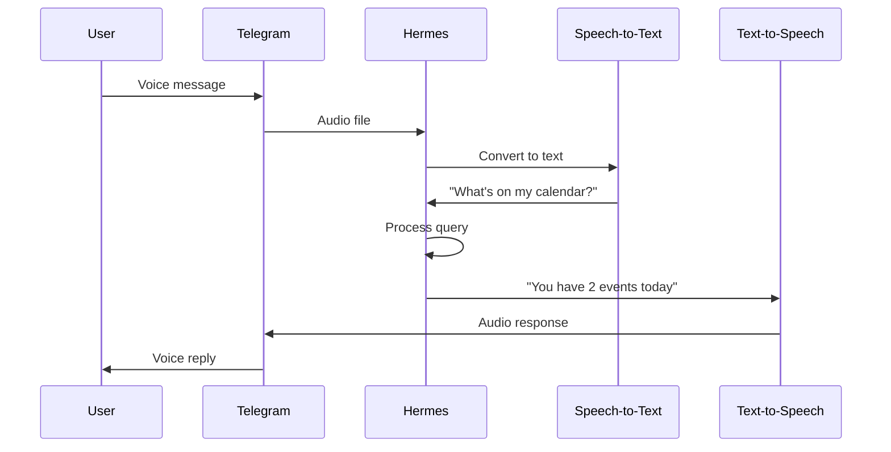

<picture>
  <source media="(prefers-color-scheme: dark)" srcset="../resources/logos/hermes-howto-logo-dark.svg">
  
</picture>

# Voice via Telegram

Interact with Hermes using voice messages through a Telegram bot.

## Overview

Telegram voice integration allows you to talk to Hermes through any Telegram client. Send voice messages, receive spoken replies, and maintain conversations on the go.

## Prerequisites

- A Telegram account
- A Telegram bot token (from [@BotFather](https://t.me/BotFather))
- Hermes with Telegram integration configured

## Setup

### 1. Create a Telegram Bot

1. Open Telegram and search for **@BotFather**
2. Send `/newbot`
3. Follow prompts to name your bot
4. Copy the bot token: `123456789:ABCdefGhIJKlmNoPQRsTUVwxyZ`

### 2. Configure Hermes

```bash
# Set Telegram bot token
export HERMES_TELEGRAM_TOKEN="your-bot-token"

# Or in config file
# ~/.hermes/config.yaml
telegram:
  enabled: true
  token: "your-bot-token"
  voice_mode: true
```

### 3. Start Hermes with Telegram

```bash
hermes --telegram
```

Or enable Telegram in configuration:

```yaml
# ~/.hermes/config.yaml
telegram:
  enabled: true
  token: "your-bot-token"
  allowed_users:
    - your_telegram_username
  voice_mode: true
```

## Using Voice Mode

### Send Voice Message

1. Open your Telegram bot conversation
2. Hold the microphone button
3. Speak your query
4. Release to send

Hermes will:
- Convert speech to text (STT)
- Process the query
- Send back a voice reply (TTS)

### Text Fallback

If voice mode fails or you prefer text:

- Send a regular text message
- Hermes responds with text
- You can still request voice replies

### Voice Settings

| Setting | Description | Default |
|---------|-------------|---------|
| `voice_mode` | Enable voice replies | true |
| `voice_language` | Language for STT | "en" |
| `voice_input_language` | Voice input language | "en-US" |

## Conversation Flow



## Commands in Telegram

When chatting with your bot:

| Command | Description |
|---------|-------------|
| `/start` | Begin conversation |
| `/help` | Show available commands |
| `/voice` | Toggle voice mode on/off |
| `/text` | Switch to text-only mode |
| `/settings` | Configure voice settings |

## Group Chats

### Allow in Groups

```yaml
telegram:
  allow_groups: true
  allowed_chats:
    - -1001234567890  # Group ID
```

### Voice in Groups

To use voice in groups, mention the bot:

1. Add bot to group
2. Send voice message mentioning @yourbot
3. Bot responds with voice reply

## Security

### Restrict Access

```yaml
telegram:
  allowed_users:
    - user_one
    - user_two
  admin_users:
    - admin_user
```

### Privacy Mode

Bot operates in privacy mode by default — only sees messages directed at it.

## Troubleshooting

### Bot Not Responding

1. Verify bot token is correct
2. Check Hermes is running with `--telegram` flag
3. Ensure bot is properly started with `/start`

### Voice Not Processing

1. Check STT backend is configured
2. Verify audio format is supported (opus, ogg)
3. Try sending as text message instead

### No Voice Reply

1. Ensure `voice_mode: true` in config
2. Check TTS backend is configured
3. Try `/voice` command to toggle

### Audio Quality Issues

- Use Telegram's built-in voice encoding (speak clearly)
- Avoid noisy environments
- Keep voice messages under 60 seconds

## Advanced Configuration

### Custom TTS Voice

```yaml
telegram:
  voice_mode: true
  tts_voice: "alloy"  # OpenAI voice options
```

### Multiple Languages

```yaml
telegram:
  voice_input_language: "en-US"
  voice_output_language: "en"
```

### Voice Activity Detection

```yaml
telegram:
  vad_enabled: true
  vad_threshold: 0.5
```

## Next Steps

- [voice-setup.md](voice-setup.md) — Configure audio backends
- [voice-cli.md](voice-cli.md) — CLI voice interaction
- [voice-discord.md](voice-discord.md) — Voice via Discord
