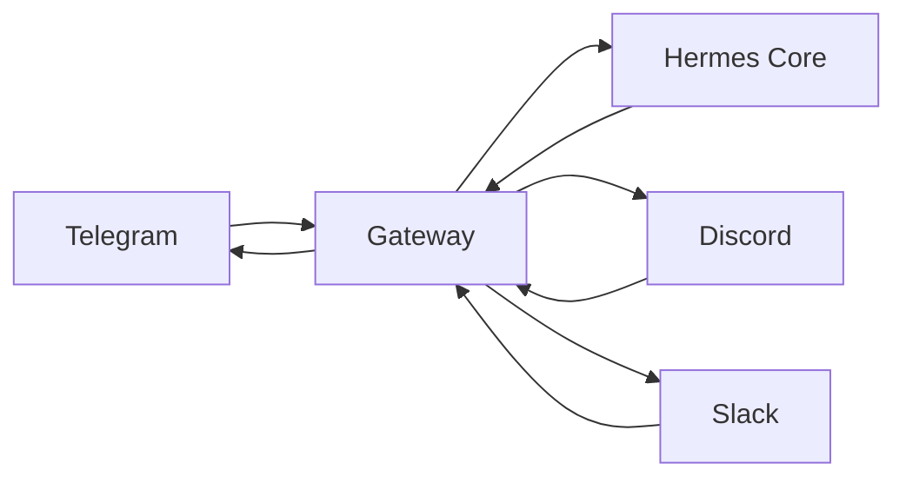
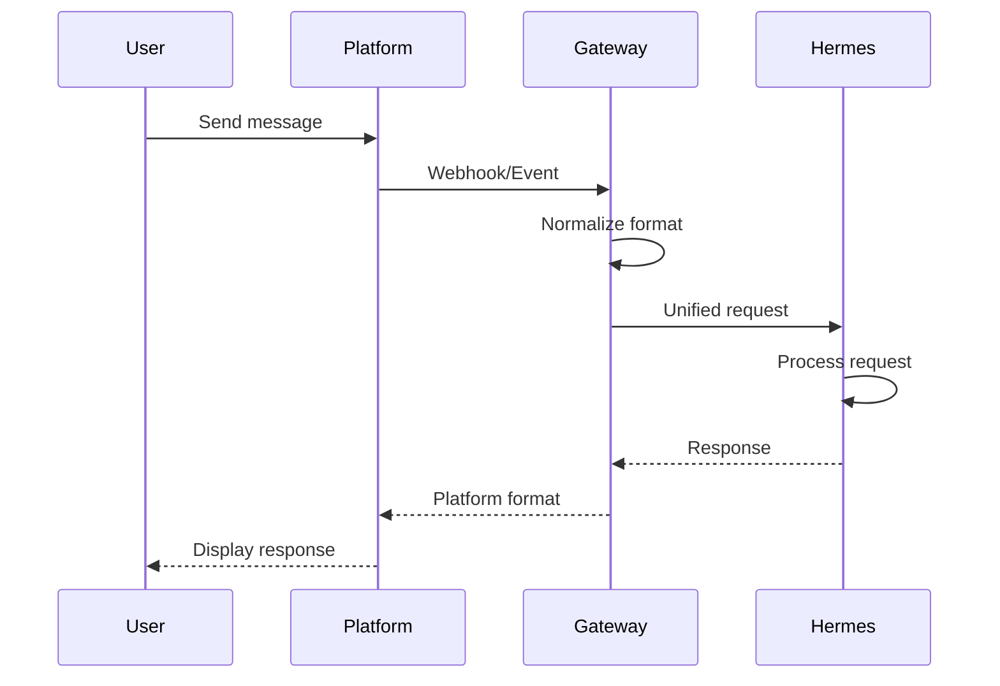

<picture>
  <source media="(prefers-color-scheme: dark)" srcset="../resources/logos/hermes-howto-logo-dark.svg">
  
</picture>

# Messaging Gateway

Connect Hermes to Telegram, Discord, and Slack for seamless messaging integration.

## Overview

The Messaging Gateway bridges Hermes with popular chat platforms, enabling you to interact with Hermes through familiar messaging apps. This module covers setup, configuration, and bot patterns for each supported platform.

### Key Benefits

- **Unified Communication**: Access Hermes from any messaging platform
- **Rich Interactions**: Leverage platform-specific features (buttons, embeds, threads)
- **Async Messaging**: Continue conversations naturally across time zones
- **Team Collaboration**: Share Hermes capabilities with your team via group chats

## What You'll Learn

| | Module | Topic |
|-|--------|-------|
| | [telegram-setup.md](telegram-setup.md) | Configure Telegram bot integration |
| | [discord-setup.md](discord-setup.md) | Configure Discord bot integration |
| | [slack-setup.md](slack-setup.md) | Configure Slack bot integration |
| | [bot-patterns/](bot-patterns/) | Reusable bot behavior patterns |

## Platform Comparison

| Feature | Telegram | Discord | Slack |
|---------|----------|---------|-------|
| **Setup Complexity** | Low | Medium | Medium |
| **Bot Type** | @username Bot | Application | App + Bot User |
| **Max Message** | 4096 chars | 2000 chars | 30000 chars |
| **Threads** | No native | Yes | Yes |
| **Slash Commands** | Via / | Yes | Yes |
| **Button Types** | Inline/Keyboard | Buttons + Selects | Buttons + Selects |
| **Groups Support** | Up to 200K | Up to 2.5M (guilds) | Via channels |

## Architecture

## Connection Flow

## Supported Features

| Feature | Telegram | Discord | Slack |
|---------|----------|---------|-------|
| Text messages | Yes | Yes | Yes |
| Commands (/cmd) | Yes | Yes | Yes |
| Inline buttons | Yes | Yes | Yes |
| Embeds | Yes | Yes | Yes |
| File attachments | Yes | Yes | Yes |
| Voice messages | Yes | Yes | No |
| Threads | No | Yes | Yes |
| Reactions | Yes | Yes | Yes |
| Mentions | Yes | Yes | Yes |

## Environment Variables

| Variable | Description | Required |
|----------|-------------|----------|
| `TELEGRAM_BOT_TOKEN` | Telegram bot API token | For Telegram |
| `DISCORD_BOT_TOKEN` | Discord bot token | For Discord |
| `SLACK_BOT_TOKEN` | Slack bot user token | For Slack |
| `SLACK_SIGNING_SECRET` | Slack request signing secret | For Slack |
| `GATEWAY_PORT` | Local webhook server port | Optional |

## Security Considerations

- **Token Storage**: Never commit tokens to version control
- **Webhook Verification**: Always validate webhook signatures
- **Rate Limiting**: Respect platform API limits
- **Input Validation**: Sanitize all incoming messages
- **Scope Principle**: Grant minimum required permissions

## Verify Your Understanding

1. Run `/lesson-quiz messaging-gateway` to test your knowledge
2. Review areas needing reinforcement
3. Proceed to next module

## Next Steps

- [telegram-setup.md](telegram-setup.md) — Start with Telegram (easiest setup)
- [discord-setup.md](discord-setup.md) — Add Discord for voice/text channels
- [slack-setup.md](slack-setup.md) — Integrate with Slack workspaces
- [bot-patterns/](bot-patterns/) — Reusable patterns for common use cases

## Getting Help

If you encounter issues:

- Verify bot tokens are correct and active
- Check webhook endpoints are reachable
- Ensure required permissions are granted
- Consult platform-specific documentation
- Check Hermes logs for connection errors
