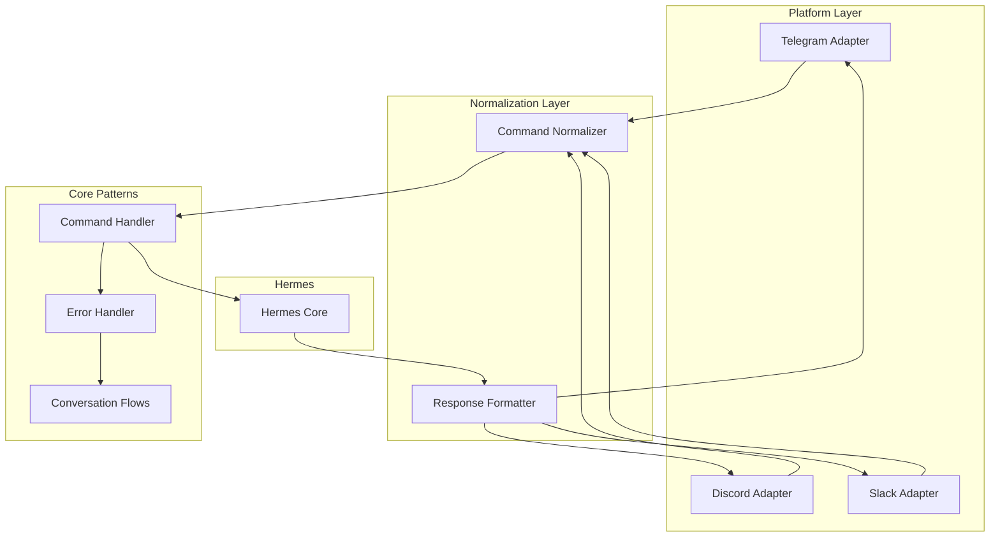

<picture>
  <source media="(prefers-color-scheme: dark)" srcset="../../resources/logos/hermes-howto-logo-dark.svg">
  
</picture>

# Bot Patterns

Reusable patterns and implementations for building messaging bot integrations.

## Overview

This directory contains battle-tested patterns for implementing bot behavior across Telegram, Discord, and Slack platforms.

## Patterns

| Pattern | Description |
|---------|-------------|
| [command-handler.md](command-handler.md) | Unified command handling across platforms |
| [response-formatters.md](response-formatters.md) | Format responses for each platform |
| [conversation-flows.md](conversation-flows.md) | Multi-turn conversation management |
| [error-handling.md](error-handling.md) | Graceful error handling strategies |

## Quick Navigation

### Command Handler

Unified approach to parsing and routing commands:

- Platform adapters (Telegram, Discord, Slack)
- Command normalization
- Middleware (rate limiting, permissions)
- Built-in commands (help, status, clear)

### Response Formatters

Format bot responses for each platform:

- Telegram markdown and HTML
- Discord embeds and components
- Slack Block Kit
- Universal formatting layer

### Conversation Flows

Manage stateful multi-turn conversations:

- State machine for conversation lifecycle
- Thread management per platform
- Intent detection
- Multi-step flows (survey, task creation)

### Error Handling

Robust error handling:

- Platform-specific error codes
- Retry logic with backoff
- Dead letter queue
- User-friendly error messages

## Architecture



## Usage

Each pattern file contains:

1. **Overview** - What the pattern solves
2. **Architecture** - How components interact
3. **Implementation** - Ready-to-use code
4. **Examples** - Common use cases
5. **Platform Notes** - Platform-specific considerations

## Combining Patterns

Patterns are designed to work together:

```python
# Initialize components
handler = CommandHandler(hermes_client)
formatter = ResponseFormatter()
flows = ConversationManager()
errors = ErrorHandler(hermes_client)

# Apply middleware
handler.use(RateLimitMiddleware())
handler.use(PermissionMiddleware())

# Handle message
async def handle(message, platform):
    normalized = platform.normalize(message)

    # Route to conversation or command
    if normalized.command:
        response = await handler.handle(normalized)
    else:
        response = await flows.continue_conversation(normalized)

    # Format and send
    formatted = formatter.format(response, platform)
    return await platform.send(formatted)
```

## Pattern Selection Guide

| Need | Pattern |
|------|---------|
| Parse `/commands` | [command-handler.md](command-handler.md) |
| Rich messages | [response-formatters.md](response-formatters.md) |
| Multi-step interactions | [conversation-flows.md](conversation-flows.md) |
| Handle failures | [error-handling.md](error-handling.md) |
| Thread management | [conversation-flows.md](conversation-flows.md) |
| Rate limiting | [command-handler.md](command-handler.md) |
| Permission checks | [command-handler.md](command-handler.md) |

## Next Steps

- [command-handler.md](command-handler.md) — Start with command handling
- [response-formatters.md](response-formatters.md) — Format platform responses
- [conversation-flows.md](conversation-flows.md) — Manage conversation state
- [error-handling.md](error-handling.md) — Handle errors gracefully
