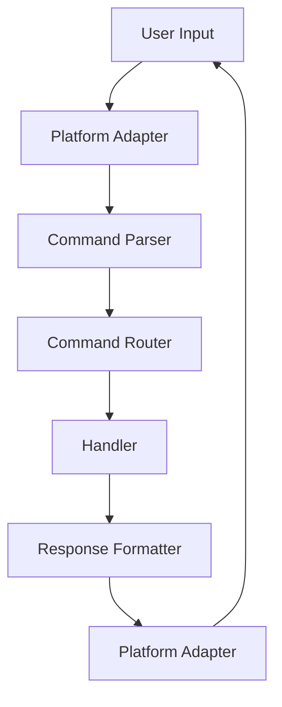

# Command Handler

Unified command handling across messaging platforms.

## Overview

The command handler provides a consistent interface for parsing and executing slash commands across Telegram, Discord, and Slack.

## Supported Commands

| Platform | Prefix | Example |
|----------|--------|---------|
| Telegram | `/` | `/help`, `/status` |
| Discord | `!` | `!help`, `!status` |
| Slack | `/` | `/help`, `/status` |

## Command Parsing

Commands are parsed consistently across platforms:

## Rate Limiting

Each user is limited to 10 commands per minute per platform.

## Permission Checks

Commands respect platform-specific permission levels:
- **Public** — Available to all users
- **Admin** — Limited to channel/server admins
- **Owner** — Limited to the bot owner

## Error Handling

See [error-handling.md](error-handling.md) for error handling patterns.
