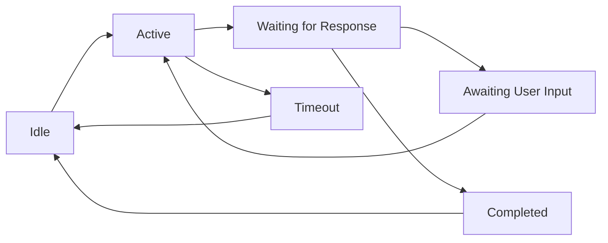

<picture>
  <source media="(prefers-color-scheme: dark)" srcset="../../resources/logos/hermes-howto-logo-dark.svg">
  
</picture>

# Conversation Flows

Managing multi-turn conversations and state across messaging platforms.

## Overview

Each messaging platform handles conversation state differently. This pattern provides a unified approach to maintaining context across Telegram, Discord, Slack, and DM channels.

## Conversation State Machine



## State Manager

```python
class ConversationState:
    IDLE = "idle"
    ACTIVE = "active"
    WAITING = "waiting"
    COMPLETED = "completed"
    TIMEOUT = "timeout"


class ConversationManager:
    def __init__(self, ttl_minutes=30):
        self.conversations = {}  # chat_id -> Conversation
        self.ttl = timedelta(minutes=ttl_minutes)

    async def get_or_create(self, chat_id, platform):
        if chat_id not in self.conversations:
            self.conversations[chat_id] = Conversation(
                id=chat_id,
                platform=platform,
                state=ConversationState.IDLE,
                history=[],
                context={},
                created_at=datetime.now(),
                updated_at=datetime.now()
            )
        return self.conversations[chat_id]

    async def update(self, chat_id, **kwargs):
        conv = await self.get_or_create(chat_id, None)
        for key, value in kwargs.items():
            setattr(conv, key, value)
        conv.updated_at = datetime.now()

        # Check for timeout
        if conv.state == ConversationState.WAITING:
            if datetime.now() - conv.updated_at > self.ttl:
                conv.state = ConversationState.TIMEOUT

        return conv
```

## Message Threading

### Telegram (No Native Threads)

```python
class TelegramThreading:
    # Telegram uses reply chains, not true threads
    # Maintain context by tracking reply_to_message_id

    async def send_in_thread(self, chat_id, message_id, text):
        return await telegram.send_message(
            chat_id=chat_id,
            text=text,
            reply_to_message_id=message_id
        )
```

### Discord (True Threads)

```python
class DiscordThreading:
    async def start_thread(self, message, name_prefix="hermes-"):
        thread = await message.create_thread(
            name=f"{name_prefix}{message.id}"
        )
        return thread

    async def reply_in_thread(self, thread_id, text):
        return await discord.send_message(
            channel_id=thread_id,
            content=text
        )
```

### Slack (Threads)

```python
class SlackThreading:
    async def reply_in_thread(self, channel, thread_ts, text):
        return await slack.chat_postMessage(
            channel=channel,
            text=text,
            thread_ts=thread_ts
        )
```

## Conversation Context

```python
@dataclass
class ConversationContext:
    platform: str
    user_id: str
    chat_id: str
    thread_id: Optional[str] = None
    state: str = ConversationState.IDLE
    intent: Optional[str] = None
    entities: Dict[str, Any] = field(default_factory=dict)
    history: List[Turn] = field(default_factory=list)
    metadata: Dict[str, Any] = field(default_factory=dict)


@dataclass
class Turn:
    role: str  # "user" or "assistant"
    content: str
    timestamp: datetime
    message_id: str
```

## Intent Detection

```python
class IntentDetector:
    def __init__(self):
        self.intents = {
            "greeting": self.detect_greeting,
            "question": self.detect_question,
            "command": self.detect_command,
            "confirmation": self.detect_confirmation,
            "cancellation": self.detect_cancellation,
        }

    def detect(self, text, context):
        for intent_name, detector in self.intents.items():
            if detector(text, context):
                return intent_name
        return "unknown"

    def detect_greeting(self, text, context):
        greetings = ["hi", "hello", "hey", "good morning", "good evening"]
        return text.lower().strip() in greetings

    def detect_question(self, text, context):
        # Check for question mark or question words
        question_patterns = [
            r"^what|^how|^why|^when|^where|^who|^which",
            r"\?$",
            r"can you|^could you|^would you"
        ]
        return any(
            re.search(p, text.lower())
            for p in question_patterns
        )

    def detect_command(self, text, context):
        return text.startswith("/") or text.startswith("!")

    def detect_confirmation(self, text, context):
        confirmations = ["yes", "yep", "sure", "ok", "okay", "confirm"]
        return text.lower().strip() in confirmations

    def detect_cancellation(self, text, context):
        cancellations = ["no", "cancel", "never mind", "stop", "quit"]
        return text.lower().strip() in cancellations
```

## Multi-Step Flows

### Question Flow

```python
class QuestionFlow:
    async def start(self, context, question):
        context.state = ConversationState.WAITING
        context.intent = "answer_question"
        context.entities["pending_question"] = question

        response = await context.hermes.ask(question)

        return Response(
            text=response.text,
            reply=context.message,
            context_updates={"pending_question": None}
        )
```

### Task Flow

```python
class TaskFlow:
    STEPS = [
        {"name": "collect_input", "prompt": "What is the task?"},
        {"name": "confirm", "prompt": "Create task '{task}'?"},
        {"name": "execute", "prompt": "Creating task..."},
        {"name": "complete", "prompt": "Task created!"},
    ]

    async def start(self, context):
        context.state = ConversationState.ACTIVE
        context.intent = "create_task"
        context.entities["task_flow_step"] = 0

        return Response(
            text=self.STEPS[0]["prompt"],
            reply=context.message
        )

    async def advance(self, context, user_input):
        step = context.entities.get("task_flow_step", 0)

        if step == 0:  # Collect task name
            context.entities["task"] = user_input
            context.entities["task_flow_step"] = 1
            return Response(
                text=f"Create task '{user_input}'? (yes/no)",
                reply=context.message
            )

        elif step == 1:  # Confirm
            if user_input.lower() in ["yes", "y"]:
                context.entities["task_flow_step"] = 2
                # Execute task creation
                result = await self.create_task(context.entities["task"])
                return Response(
                    text=f"Task created: {result}",
                    reply=context.message
                )
            else:
                return Response(
                    text="Task creation cancelled.",
                    reply=context.message
                )
```

### Survey Flow

```python
class SurveyFlow:
    async def start(self, context, questions):
        context.state = ConversationState.ACTIVE
        context.intent = "survey"
        context.entities["survey"] = {
            "questions": questions,
            "current_index": 0,
            "answers": {}
        }

        return Response(
            text=f"Starting survey: {questions[0]}",
            reply=context.message,
            buttons=[
                {"text": "Cancel", "action": "survey_cancel"}
            ]
        )

    async def process_answer(self, context, answer):
        survey = context.entities["survey"]
        q_index = survey["current_index"]

        # Save answer
        survey["answers"][survey["questions"][q_index]] = answer

        # Move to next question or complete
        q_index += 1
        if q_index >= len(survey["questions"]):
            # Complete survey
            return await self.complete_survey(context)
        else:
            survey["current_index"] = q_index
            return Response(
                text=f"Next: {survey['questions'][q_index]}",
                reply=context.message
            )
```

## Timeout Handling

```python
class TimeoutHandler:
    async def handle_timeout(self, context):
        if context.intent == "survey":
            return Response(
                text="Survey timed out. Send /start to begin again.",
                reply=context.message
            )
        elif context.intent == "task":
            return Response(
                text="Task creation timed out. Send /newtask to try again.",
                reply=context.message
            )
        else:
            return Response(
                text="Conversation timed out.",
                reply=context.message
            )
```

## History Management

```python
class HistoryManager:
    def __init__(self, max_turns=50):
        self.max_turns = max_turns

    async def add_turn(self, context, role, content, message_id):
        context.history.append(Turn(
            role=role,
            content=content,
            timestamp=datetime.now(),
            message_id=message_id
        ))

        # Trim if too long
        if len(context.history) > self.max_turns:
            context.history = context.history[-self.max_turns:]

    async def get_recent(self, context, num_turns=10):
        return context.history[-num_turns:]

    async def format_for_hermes(self, context):
        # Format conversation history for Hermes
        messages = []
        for turn in context.history[-20:]:  # Last 20 turns
            messages.append({
                "role": turn.role,
                "content": turn.content
            })
        return messages
```

## Context Injection

```python
class ContextBuilder:
    def build(self, platform, user_id, chat_id, thread_id=None):
        return ConversationContext(
            platform=platform,
            user_id=user_id,
            chat_id=chat_id,
            thread_id=thread_id,
            state=ConversationState.IDLE
        )

    def inject_system_prompt(self, context):
        platform_specific = {
            "telegram": "You are in a Telegram chat.",
            "discord": "You are in a Discord server.",
            "slack": "You are in a Slack workspace."
        }

        return f"""
{platform_specific.get(context.platform, "You are in a messaging app.")}

User: {context.user_id}
Chat: {context.chat_id}
Thread: {context.thread_id or 'N/A'}
"""
```

## Platform-Specific Considerations

### Telegram

- No native threads, use reply chains
- 4096 character message limit
- No built-in typing indicators (simulate with delays)
- Edit messages instead of new messages when appropriate

### Discord

- True threads with separate history
- 2000 character message limit
- Use embeds for rich content
- Button interactions via message components

### Slack

- Threads by `thread_ts`
- 30000 character message limit
- Use Block Kit for structured content
- Interactive components via dialogs

## Next Steps

- [error-handling.md](error-handling.md) — Handle errors gracefully
- [command-handler.md](command-handler.md) — Back to command handling
