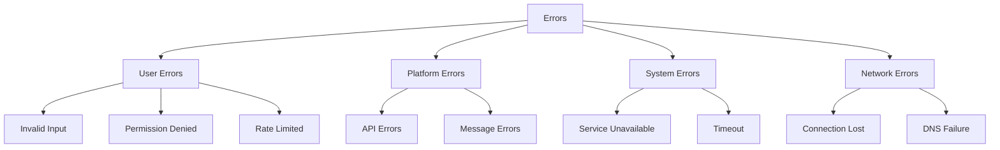

<picture>
  <source media="(prefers-color-scheme: dark)" srcset="../../resources/logos/hermes-howto-logo-dark.svg">
  
</picture>

# Error Handling

Graceful error handling strategies for messaging bots across platforms.

## Overview

Each platform handles errors differently. A robust bot pattern gracefully manages errors, provides helpful feedback, and maintains user trust.

## Error Categories



## Error Response Pattern

```python
class BotError(Exception):
    def __init__(self, message, code=None, recoverable=True):
        self.message = message
        self.code = code
        self.recoverable = recoverable
        super().__init__(message)


class ErrorHandler:
    def __init__(self, hermes_client):
        self.hermes = hermes_client
        self.error_log = []

    async def handle(self, error, context):
        # Log error
        self.log_error(error, context)

        # Determine response
        if isinstance(error, BotError):
            return await self.handle_bot_error(error, context)
        elif isinstance(error, PlatformError):
            return await self.handle_platform_error(error, context)
        elif isinstance(error, HermesError):
            return await self.handle_hermes_error(error, context)
        else:
            return await self.handle_unknown_error(error, context)

    async def handle_bot_error(self, error, context):
        return Response(
            text=f"⚠️ {error.message}",
            reply=context.message,
            retry=error.recoverable
        )
```

## User Error Handling

### Invalid Command

```python
async def handle_invalid_command(self, context, attempted_cmd):
    suggestions = self.get_command_suggestions(attempted_cmd)

    text = f"Unknown command: `{attempted_cmd}`\n\n"
    if suggestions:
        text += "Did you mean:\n"
        for cmd in suggestions:
            text += f"  `/{cmd}`\n"
    else:
        text += "Type `/help` for available commands."

    return Response(
        text=text,
        reply=context.message,
        format="markdown"
    )
```

### Permission Denied

```python
async def handle_permission_denied(self, context, action):
    return Response(
        text=f"⛔ You don't have permission to `{action}`.",
        reply=context.message
    )
```

### Rate Limited (User)

```python
async def handle_user_rate_limit(self, context, retry_after):
    return Response(
        text=f"⏳ You're sending too fast. Please wait {retry_after}s.",
        reply=context.message,
        retry_after=retry_after
    )
```

## Platform Error Handling

### Telegram Errors

```python
class TelegramErrorHandler:
    ERROR_CODES = {
        400: "Bad Request",
        401: "Unauthorized",
        403: "Forbidden",
        404: "Not Found",
        429: "Too Many Requests",
        500: "Internal Server Error",
    }

    async def handle_telegram_error(self, error, context):
        code = getattr(error, 'error_code', None)
        message = error.message if hasattr(error, 'message') else str(error)

        if code == 429:
            # Rate limited
            retry_after = getattr(error, 'retry_after', 60)
            return Response(
                text=f"⏳ Telegram rate limit. Retrying in {retry_after}s...",
                retry_after=retry_after
            )
        elif code == 403:
            if "bot was blocked by the user" in message.lower():
                await self.handle_blocked_bot(context)
                return None  # Don't retry
            return Response(
                text="⛔ Cannot send message. Bot may be blocked.",
                reply=context.message
            )
        elif code == 400:
            if "chat not found" in message.lower():
                return Response(
                    text="Chat not found. Please start a conversation.",
                    reply=context.message
                )
            return Response(
                text=f"⚠️ Invalid request: {message}",
                reply=context.message
            )
        else:
            return Response(
                text="⚠️ Telegram error occurred. Please try again.",
                retry=True
            )
```

### Discord Errors

```python
class DiscordErrorHandler:
    ERROR_CODES = {
        20001: "Missing Access",
        30001: "Missing Permissions",
        30010: "Max Conversations",
        40001: "Unauthorized",
        50001: "Missing Access",
        50013: "Missing Permissions",
    }

    async def handle_discord_error(self, error, context):
        code = getattr(error, 'code', None)
        message = str(error)

        if code == 50013 or code == 30001:
            return Response(
                text="⛔ I don't have permission to do that.",
                reply=context.message
            )
        elif code == 20001 or code == 50001:
            return Response(
                text="⛔ I don't have access to that channel or resource.",
                reply=context.message
            )
        elif code == 30010:
            return Response(
                text="⛔ Maximum threads reached in this channel.",
                reply=context.message
            )
        else:
            return Response(
                text="⚠️ Discord error occurred. Please try again.",
                retry=True
            )
```

### Slack Errors

```python
class SlackErrorHandler:
    async def handle_slack_error(self, error, context):
        code = getattr(error, 'response', {}).get('error', 'unknown')

        if code == "channel_not_found":
            return Response(
                text="⛔ Channel not found. Please invite me first.",
                reply=context.message
            )
        elif code == "not_authed":
            return Response(
                text="⛔ Not properly authenticated. Please reinstall.",
                reply=context.message
            )
        elif code == "token_revoked":
            return Response(
                text="⛔ Token revoked. Please re-authorize.",
                reply=context.message
            )
        elif code == "ratelimited":
            retry_after = getattr(error, 'retry_after', 60)
            return Response(
                text=f"⏳ Rate limited. Retrying in {retry_after}s...",
                retry_after=retry_after
            )
        elif code == "msg_too_long":
            # Truncate message
            return await self.send_truncated(context)
        else:
            return Response(
                text="⚠️ Slack error occurred. Please try again.",
                retry=True
            )
```

## Hermes Error Handling

```python
class HermesErrorHandler:
    async def handle_hermes_error(self, error, context):
        if isinstance(error, HermesTimeoutError):
            return Response(
                text="⏳ Request timed out. Please try again.",
                retry=True,
                retry_after=30
            )
        elif isinstance(error, HermesRateLimitError):
            return Response(
                text="⏳ Service is busy. Please wait a moment.",
                retry=True,
                retry_after=60
            )
        elif isinstance(error, HermesModelError):
            return Response(
                text="⚠️ AI model error. Please try again later.",
                retry=True
            )
        elif isinstance(error, HermesContextError):
            # Context too long, try to summarize
            return await self.handle_context_overflow(context)
        else:
            return Response(
                text="⚠️ An unexpected error occurred.",
                retry=True
            )

    async def handle_context_overflow(self, context):
        # Summarize older messages
        summary = await context.hermes.summarize(context.history[:-10])

        # Replace old history with summary
        context.history = summary + context.history[-10:]

        return Response(
            text="📝 I've summarized our earlier conversation to continue.",
            reply=context.message
        )
```

## Retry Logic

```python
class RetryHandler:
    def __init__(self, max_retries=3, backoff_factor=2):
        self.max_retries = max_retries
        self.backoff_factor = backoff_factor

    async def with_retry(self, func, *args, **kwargs):
        last_error = None

        for attempt in range(self.max_retries):
            try:
                return await func(*args, **kwargs)
            except RetryableError as e:
                last_error = e
                if attempt < self.max_retries - 1:
                    delay = self.backoff_factor ** attempt
                    await asyncio.sleep(delay)

        raise last_error


class RetryableError(BotError):
    """Errors that can be retried."""
    def __init__(self, message):
        super().__init__(message, recoverable=True)
```

## Dead Letter Queue

```python
class DeadLetterQueue:
    def __init__(self, storage_path):
        self.queue = []
        self.storage_path = storage_path
        self.load()

    def add(self, message, error, context):
        entry = {
            "message": message,
            "error": str(error),
            "context": {
                "platform": context.platform,
                "user_id": context.user_id,
                "chat_id": context.chat_id
            },
            "timestamp": datetime.now().isoformat(),
            "retry_count": 0
        }
        self.queue.append(entry)
        self.save()

    def retry_next(self):
        for i, entry in enumerate(self.queue):
            if entry["retry_count"] < 3:
                entry["retry_count"] += 1
                self.save()
                return entry
        return None

    def mark_complete(self, index):
        if 0 <= index < len(self.queue):
            self.queue.pop(index)
            self.save()
```

## Error Logging

```python
class ErrorLogger:
    def __init__(self, log_path):
        self.log_path = log_path

    async def log(self, error, context, stack_trace=None):
        entry = {
            "error": {
                "type": type(error).__name__,
                "message": str(error),
                "code": getattr(error, 'code', None)
            },
            "context": {
                "platform": context.platform,
                "user_id": context.user_id,
                "chat_id": context.chat_id,
                "message_text": context.message.text if context.message else None
            },
            "timestamp": datetime.now().isoformat(),
            "stack_trace": stack_trace
        }

        async with aiofiles.open(self.log_path, 'a') as f:
            await f.write(json.dumps(entry) + "\n")
```

## User-Friendly Messages

Map technical errors to user-friendly messages:

| Error Type | User Message |
|------------|--------------|
| Network timeout | "Having trouble connecting. Please try again." |
| Rate limited | "You're doing that too fast. Please wait." |
| Service unavailable | "Service is temporarily unavailable. Please try later." |
| Invalid input | "I didn't understand that. Could you rephrase?" |
| Permission denied | "You don't have permission for that action." |
| Message too long | "That message is too long. Can you shorten it?" |
| Unknown error | "Something went wrong. Please try again." |

## Recovery Patterns

### Automatic Retry

```python
async def send_with_retry(self, response, context, max_retries=3):
    for attempt in range(max_retries):
        try:
            await self.send(response, context)
            return True
        except RetryableError as e:
            if attempt < max_retries - 1:
                await asyncio.sleep(2 ** attempt)
            continue
    return False
```

### Graceful Degradation

```python
async def send_grade_response(self, response, context):
    # Try full response with formatting
    try:
        await self.send_full(response, context)
    except MessageTooLongError:
        # Strip formatting
        response.strip_formatting()
        try:
            await self.send(response, context)
        except MessageTooLongError:
            # Send as plain text, truncated
            response.truncate(self.platform_limits[context.platform]["max_length"])
            await self.send(response, context)
```

## Next Steps

- [command-handler.md](command-handler.md) — Back to command handling
- [response-formatters.md](response-formatters.md) — Format responses
