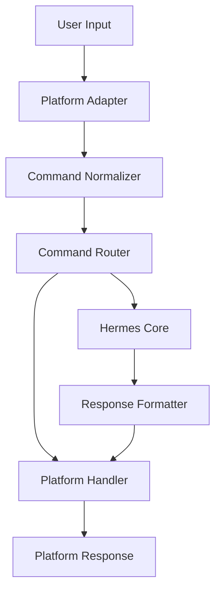

<picture>
  <source media="(prefers-color-scheme: dark)" srcset="../../resources/logos/hermes-howto-logo-dark.svg">
  
</picture>

# Command Handler Pattern

A unified approach to handling bot commands across all messaging platforms.

## Overview

Command handlers normalize user input across Telegram, Discord, and Slack into a consistent format that Hermes can process.

## Architecture



## Command Structure

```yaml
commands:
  prefix: "/"           # Command prefix (/ask, /status)
  aliases:
    help: ["h", "?"]
    status: ["up", "health"]
  case_sensitive: false
```

## Basic Command Handler

```python
class CommandHandler:
    def __init__(self, hermes_client):
        self.hermes = hermes_client
        self.commands = {}
        
    def register(self, name, handler, aliases=None):
        self.commands[name] = {
            "handler": handler,
            "aliases": aliases or [],
            "name": name
        }
    
    async def handle(self, message, context):
        # Parse command
        cmd = self.parse_command(message.text)
        if not cmd:
            return None
            
        # Find handler
        handler = self.find_handler(cmd.name)
        if not handler:
            return await self.unknown_command(cmd)
            
        # Execute with context
        return await handler["handler"](cmd, context)
    
    def parse_command(self, text):
        # Handle platform variations
        # /command@botname or /command
        parts = text.strip().split()
        if not parts or not parts[0].startswith("/"):
            return None
            
        raw_cmd = parts[0][1:]  # Remove /
        # Split on @ for @botname suffix
        cmd_parts = raw_cmd.split("@")
        
        return Command(
            name=cmd_parts[0].lower(),
            args=parts[1:],
            raw=text
        )
```

## Platform Adapters

### Telegram Adapter

```python
class TelegramAdapter:
    def normalize(self, update):
        message = update.message
        
        return NormalizedMessage(
            platform="telegram",
            user_id=str(message.from_user.id),
            chat_id=str(message.chat.id),
            text=message.text or message.caption,
            command=self.extract_command(message.text),
            attachments=self.extract_attachments(message),
            reply_to=message.reply_to_message,
            timestamp=message.date
        )
    
    def extract_command(self, text):
        if not text or not text.startswith("/"):
            return None
        return text.split()[0][1:].split("@")[0]
    
    def extract_attachments(self, message):
        attachments = []
        
        if message.photo:
            attachments.append({
                "type": "photo",
                "id": message.photo[-1].file_id,
                "sizes": len(message.photo)
            })
        if message.document:
            attachments.append({
                "type": "document",
                "id": message.document.file_id,
                "name": message.document.file_name
            })
        if message.voice:
            attachments.append({
                "type": "voice",
                "id": message.voice.file_id,
                "duration": message.voice.duration
            })
            
        return attachments
```

### Discord Adapter

```python
class DiscordAdapter:
    def normalize(self, message):
        # Parse mentions
        content = self.parse_mentions(message.content)
        
        return NormalizedMessage(
            platform="discord",
            user_id=str(message.author.id),
            channel_id=str(message.channel.id),
            guild_id=str(message.guild.id) if message.guild else None,
            text=content,
            command=self.extract_command(content),
            attachments=[
                {
                    "type": att.type,
                    "id": str(att.id),
                    "url": att.url
                }
                for att in message.attachments
            ],
            reply_to=message.reference,
            thread_id=str(message.thread.id) if message.thread else None,
            timestamp=message.created_at
        )
    
    def parse_mentions(self, content):
        # Convert <@USER_ID> to @username
        # Convert <#CHANNEL_ID> to #channelname
        return content
    
    def extract_command(self, content):
        # Check for slash command
        if content.startswith("/"):
            return content.split()[0][1:]
        # Check for @botname command
        if "<@" in content:
            return self.parse_mention_command(content)
        return None
```

### Slack Adapter

```python
class SlackAdapter:
    def normalize(self, event):
        return NormalizedMessage(
            platform="slack",
            user_id=event.user,
            channel_id=event.channel,
            team_id=event.team,
            text=self.parse_text(event.text),
            command=self.extract_command(event),
            attachments=self.extract_attachments(event),
            thread_ts=event.thread_ts,
            timestamp=event.event_ts
        )
    
    def parse_text(self, text):
        # Convert <@USER_ID> to @username
        # Convert <#CHANNEL_ID> to #channelname
        # Convert <!command> to @command
        return text
    
    def extract_command(self, event):
        # Check for slash command in payload
        if hasattr(event, 'command'):
            return event.command
        # Check for @botname
        if "<@" in event.text:
            parts = event.text.split()
            for part in parts:
                if part.startswith("<@") and ">" in part:
                    return part[2:].split(">")[0]
        return None
```

## Command Router

```python
class CommandRouter:
    def __init__(self):
        self.routes = {}
        self.default_handler = None
        
    def register(self, command, handler, platforms=None):
        platforms = platforms or ["telegram", "discord", "slack"]
        for platform in platforms:
            if platform not in self.routes:
                self.routes[platform] = {}
            self.routes[platform][command] = handler
    
    def route(self, normalized_message):
        platform = normalized_message.platform
        command = normalized_message.command
        
        if not command:
            return self.default_handler
            
        platform_routes = self.routes.get(platform, {})
        handler = platform_routes.get(command)
        
        if not handler:
            # Try global commands
            for p_routes in self.routes.values():
                if command in p_routes:
                    return p_routes[command]
                    
        return handler
```

## Built-in Commands

### Help Command

```python
async def help_command(cmd, context):
    hermes = context.hermes
    
    help_text = """
*Available Commands*

`/ask <question>` - Ask Hermes anything
`/help` - Show this help message
`/status` - Check Hermes status
`/clear` - Clear conversation history
`/memory` - Show memory information
`/model` - Show current model

_Just type your question directly for quick answers._
"""
    
    return Response(
        text=help_text,
        format="markdown",
        reply=context.message
    )
```

### Status Command

```python
async def status_command(cmd, context):
    status = await context.hermes.get_status()
    
    status_text = f"""
*Hermes Status*

**Model**: {status.model}
**Provider**: {status.provider}
**Memory**: {status.memory_used} / {status.memory_total}
**Uptime**: {status.uptime}
**Platform**: {status.platform}
"""
    
    return Response(
        text=status_text,
        format="markdown",
        reply=context.message
    )
```

### Clear Command

```python
async def clear_command(cmd, context):
    await context.hermes.clear_conversation(
        user_id=context.user_id,
        chat_id=context.chat_id
    )
    
    return Response(
        text="Conversation cleared.",
        reply=context.message
    )
```

## Command Middleware

```python
class CommandMiddleware:
    def __init__(self):
        self.middlewares = []
        
    def use(self, middleware):
        self.middlewares.append(middleware)
        
    async def process(self, message, context, handler):
        for mw in self.middlewares:
            result = await mw.process(message, context)
            if result is not None:
                return result
        return await handler(message, context)


class RateLimitMiddleware:
    def __init__(self, max_per_minute=20):
        self.max_per_minute = max_per_minute
        self.requests = {}
        
    async def process(self, message, context):
        key = f"{context.platform}:{context.user_id}"
        now = time.time()
        
        # Clean old requests
        self.requests[key] = [
            t for t in self.requests.get(key, [])
            if now - t < 60
        ]
        
        if len(self.requests.get(key, [])) >= self.max_per_minute:
            return Response(
                text="Rate limit exceeded. Please wait.",
                reply=context.message
            )
            
        self.requests.setdefault(key, []).append(now)
        return None  # Continue to handler


class PermissionMiddleware:
    def __init__(self, allowed_roles=None):
        self.allowed_roles = allowed_roles or []
        
    async def process(self, message, context):
        user_roles = context.user_roles or []
        
        if not self.allowed_roles:
            return None  # No restrictions
            
        if not any(role in self.allowed_roles for role in user_roles):
            return Response(
                text="You don't have permission for this command.",
                reply=context.message
            )
        return None
```

## Usage Example

```python
# Initialize handlers
command_handler = CommandHandler(hermes_client)

# Register middleware
middleware = CommandMiddleware()
middleware.use(RateLimitMiddleware(max_per_minute=20))
middleware.use(PermissionMiddleware(allowed_roles=["admin", "moderator"]))

# Register commands
command_handler.register("help", help_command)
command_handler.register("status", status_command)
command_handler.register("clear", clear_command)

# In gateway loop
async def handle_message(message, platform_adapter):
    normalized = platform_adapter.normalize(message)
    context = await build_context(normalized, hermes_client)
    
    response = await middleware.process(
        normalized,
        context,
        command_handler.handle
    )
    
    if response:
        await platform_adapter.send_response(response, context)
```

## Next Steps

- [response-formatters.md](response-formatters.md) — Format responses for each platform
- [conversation-flows.md](conversation-flows.md) — Manage conversation state
