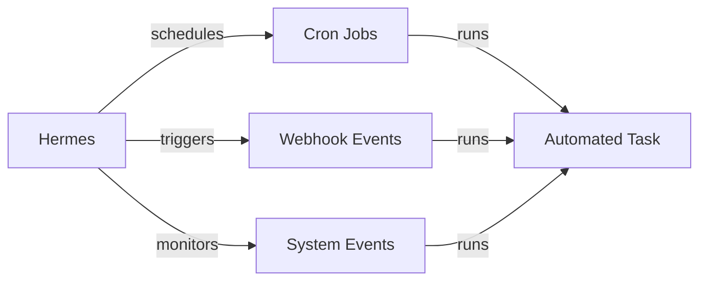

<picture>
  <source media="(prefers-color-scheme: dark)" srcset="../resources/logos/hermes-howto-logo-dark.svg">
  
</picture>

# Cron & Automation

Schedule automated tasks, webhook triggers, and recurring jobs in Hermes.

## Overview

Cron & Automation enables you to:

- **Schedule Recurring Tasks** — Run tasks on cron schedules (hourly, daily, weekly)
- **Webhook Triggers** — Execute tasks when external events occur
- **Event-Driven Automation** — React to system events and conditions
- **Workflow Scheduling** — Chain tasks into automated pipelines



## What You'll Learn

| | Topic | Description |
|---|-------|-------------|
| | [cron-quickstart.md](cron-quickstart.md) | Getting started with scheduled tasks |
| | [webhook-triggers.md](webhook-triggers.md) | Webhook configuration and event triggers |
| | [cron-examples/](cron-examples/) | Ready-to-use cron configurations |

## Key Concepts

### Scheduling Types

| Type | Use Case | Example |
|------|----------|---------|
| **Cron** | Time-based scheduling | "Every day at 9am" |
| **Interval** | Fixed frequency | "Every 15 minutes" |
| **Webhook** | Event-driven | "When GitHub push occurs" |
| **Manual** | On-demand execution | "Run now button" |

### Cron Expression Format

```
┌───────────── minute (0-59)
│ ┌───────────── hour (0-23)
│ │ ┌───────────── day of month (1-31)
│ │ │ ┌───────────── month (1-12)
│ │ │ │ ┌───────────── day of week (0-6)
│ │ │ │ │
* * * * *
```

| Field | Values | Special Characters |
|-------|--------|-------------------|
| minute | 0-59 | * , - / |
| hour | 0-23 | * , - / |
| day | 1-31 | * , - / |
| month | 1-12 | * , - / |
| weekday | 0-6 | * , - / |

### Common Cron Examples

| Expression | Meaning |
|------------|---------|
| `0 * * * *` | Every hour at minute 0 |
| `0 9 * * *` | Every day at 9:00 AM |
| `0 9 * * 1-5` | Weekdays at 9:00 AM |
| `*/15 * * * *` | Every 15 minutes |
| `0 0 * * 0` | Every Sunday at midnight |
| `0 0 1 * *` | First day of every month |

## Job Management

| Task | Command |
|------|---------|
| List jobs | `cron list` |
| Add job | `cron add <name> <schedule> <task>` |
| Remove job | `cron remove <name>` |
| Enable job | `cron enable <name>` |
| Disable job | `cron disable <name>` |
| Run now | `cron run <name>` |
| View history | `cron history <name>` |

## Webhook Events

| Event | Trigger |
|-------|---------|
| `push` | Git push to repository |
| `pull_request` | PR created or updated |
| `schedule` | Cron schedule matched |
| `http` | HTTP request to endpoint |
| `file_change` | File modified |

## File Locations

| Type | Location | Scope |
|------|---------|-------|
| **Project jobs** | `.claude/cron/` | Current project |
| **User jobs** | `~/.claude/cron/` | All projects |

## Next Steps

- [cron-quickstart.md](cron-quickstart.md) — Schedule your first task
- [webhook-triggers.md](webhook-triggers.md) — Configure webhook events
- [cron-examples/](cron-examples/) — Example configurations
