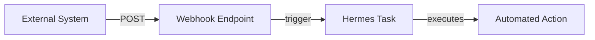

<picture>
  <source media="(prefers-color-scheme: dark)" srcset="../resources/logos/hermes-howto-logo-dark.svg">
  
</picture>

# Webhook Triggers

Execute tasks in response to external events via webhooks.

## Overview

Webhook triggers enable Hermes to react to events from external systems:

- **Git Events** — Pushes, pull requests, releases
- **HTTP Requests** — Custom webhook endpoints
- **File Changes** — Monitor files for modifications
- **Scheduled Events** — Time-based triggers
- **Custom Events** — Define your own event types



## Webhook Configuration

### Basic Webhook Setup

```yaml
webhook:
  name: github-push-handler
  endpoint: /webhook/github
  events:
    - push
    - pull_request
  task:
    prompt: "Process the incoming GitHub event and take appropriate action"
```

### Webhook Fields

| Field | Type | Required | Description |
|-------|------|----------|-------------|
| `name` | string | Yes | Unique webhook identifier |
| `endpoint` | string | Yes | URL path for the webhook |
| `secret` | string | No | Shared secret for signature verification |
| `events` | string[] | Yes | List of event types to handle |
| `task` | object | Yes | Task to execute on trigger |

## Event Types

### Git Events

| Event | Trigger |
|-------|---------|
| `push` | Code pushed to repository |
| `pull_request` | PR opened, updated, or closed |
| `pull_request.opened` | New PR created |
| `pull_request.merged` | PR merged |
| `issue.opened` | New issue created |
| `issue.commented` | Comment added to issue |
| `release.published` | New release published |
| `tag.created` | New tag created |

### HTTP Events

| Event | Trigger |
|-------|---------|
| `http.post` | POST request to endpoint |
| `http.get` | GET request to endpoint |
| `http.put` | PUT request to endpoint |
| `http.delete` | DELETE request to endpoint |

### File Events

| Event | Trigger |
|-------|---------|
| `file.created` | New file created |
| `file.modified` | Existing file changed |
| `file.deleted` | File removed |
| `file.pattern` | Files matching glob pattern |

### Schedule Events

| Event | Trigger |
|-------|---------|
| `schedule.cron` | Cron expression matched |
| `schedule.interval` | Fixed interval elapsed |

## Webhook Examples

### GitHub Push Webhook

```yaml
webhook:
  name: github-push
  endpoint: /webhook/github
  secret:
    type: env
    name: WEBHOOK_SECRET
  events:
    - push
  filters:
    branches:
      - main
      - develop
  task:
    prompt: |
      Analyze the recent push and provide:
      1. Summary of changes
      2. Files that were modified
      3. Any potential issues or concerns
```

### Pull Request Webhook

```yaml
webhook:
  name: github-pr-handler
  endpoint: /webhook/github
  events:
    - pull_request.opened
    - pull_request.updated
  task:
    prompt: |
      Review the pull request:
      1. Check description and completeness
      2. Identify any missing information
      3. Suggest initial review comments
```

### File Watch Webhook

```yaml
webhook:
  name: config-watcher
  endpoint: /webhook/file
  events:
    - file.modified
  filters:
    paths:
      - "*.yaml"
      - "*.yml"
      - "config/*"
  task:
    prompt: "Validate the modified configuration file and check for syntax errors"
```

### Custom HTTP Webhook

```yaml
webhook:
  name: custom-webhook
  endpoint: /webhook/custom
  events:
    - http.post
  task:
    prompt: "Process the incoming webhook payload and log the event details"
```

## Signature Verification

Verify webhook signatures for security:

```yaml
webhook:
  name: verified-github
  endpoint: /webhook/github
  secret:
    type: env
    name: WEBHOOK_SECRET
  signature:
    header: X-Hub-Signature-256
    algorithm: sha256
  events:
    - push
```

### Verification Methods

| Header | Algorithm | Description |
|--------|-----------|-------------|
| `X-Hub-Signature-256` | SHA256 | GitHub default |
| `X-Hub-Signature` | SHA1 | GitHub legacy |
| `X-Slack-Signature` | HMAC | Slack webhooks |

## Filter Conditions

Filter which events trigger tasks:

### Branch Filter

```yaml
filters:
  branches:
    - main
    - develop
    - release/*
```

### Path Filter

```yaml
filters:
  paths:
    - "src/**/*.ts"
    - "*.md"
    - "docs/**"
```

### Event Filter

```yaml
filters:
  events:
    - push
  conditions:
    - type: compare
      field: payload.commits.length
      operator: greater_than
      value: 0
```

## Task Context

When a webhook triggers, the task receives context:

| Variable | Description |
|----------|-------------|
| `event.type` | Type of event that triggered |
| `event.timestamp` | When the event occurred |
| `payload` | Original webhook payload |
| `headers` | HTTP headers from request |
| `signature` | Verification signature |

### Accessing Payload Data

```
Extract the changed files from the webhook payload and review each one
```

## Webhook Management

| Task | Command |
|------|---------|
| List webhooks | `webhook list` |
| Add webhook | `webhook add <name> <config>` |
| Remove webhook | `webhook remove <name>` |
| Test webhook | `webhook test <name>` |
| View logs | `webhook logs <name>` |
| Enable webhook | `webhook enable <name>` |
| Disable webhook | `webhook disable <name>` |

## Testing Webhooks

### Send Test Event

```
Send a test push event to the github-push webhook
```

### View Recent Triggers

```
Show me recent webhook triggers for the github-push webhook
```

## Troubleshooting

### Webhook Not Triggering

1. Verify endpoint URL is correct and accessible
2. Check webhook is enabled: `webhook list`
3. Ensure event type matches your configuration
4. Review webhook logs for errors

### Signature Verification Failed

1. Verify shared secret is correct
2. Check signature algorithm matches sender
3. Ensure payload hasn't been modified in transit
4. Check timestamp is within acceptable window

### Task Not Executing

1. Check task configuration is valid
2. Verify task prompt is properly formatted
3. Review execution history for errors
4. Ensure timeout is sufficient for the task

## Next Steps

- [cron-examples/](cron-examples/) — Example cron and webhook configurations
- [cron-quickstart.md](cron-quickstart.md) — Time-based scheduling
