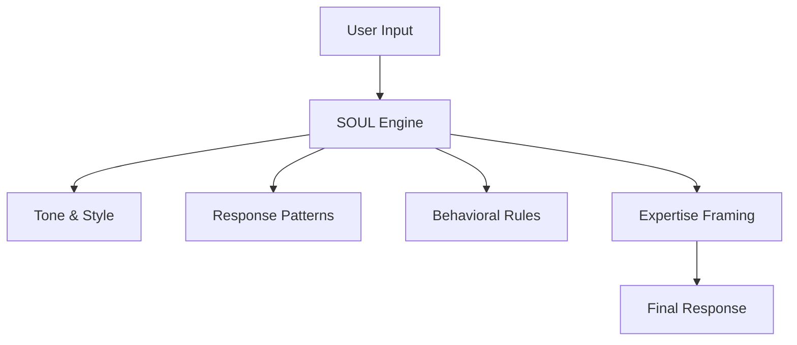
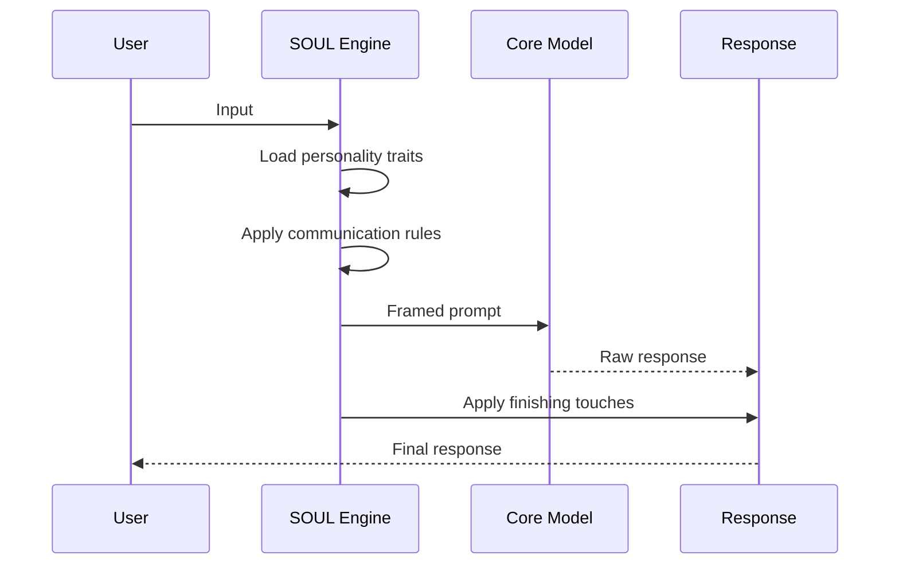

<picture>
  <source media="(prefers-color-scheme: dark)" srcset="../resources/logos/hermes-howto-logo-dark.svg">
  
</picture>

# SOUL/Personality System

The SOUL system defines Hermes's unique personality — a set of core traits, communication style, and behavioral patterns that shape every interaction. Unlike Skills (which add capabilities) or Delegation (which spawns subagents), SOUL defines *how* Hermes thinks and communicates.

## Overview

**SOUL** (Systemic Operational Utility Layer) is Hermes's personality engine. It transforms generic AI responses into consistent, branded interactions that reflect your values, communication style, and expertise.

## What You'll Learn

| Module | Topic |
|--------|-------|
| [soul-md.md](soul-md.md) | SOUL.md format and structure |
| [personality-creation.md](personality-creation.md) | Step-by-step personality creation guide |
| [personality-examples/](personality-examples/) | Ready-to-use personality templates |

## Why SOUL Matters

||| Without SOUL | With SOUL |
|--------|---------------|--------------|
| **Consistency** | Varies by prompt | Uniform across sessions |
| **Branding** | Generic AI voice | Your unique identity |
| **Trust** | Generic responses | Familiar communication style |
| **Efficiency** | Repeat instructions | Persistent personality |

## SOUL vs Other Features

| Feature | What It Does | Analogy |
|---------|--------------|---------|
| **SOUL** | Shapes how Hermes communicates | Personality/DNA |
| **Skills** | Adds what Hermes can do | Capabilities/Expertise |
| **Delegation** | Spawns other agents | Team members |
| **Memory** | Stores what Hermes knows | Knowledge base |

## SOUL Architecture

## Key Concepts

### Personality Layers

1. **Core Traits** — Fundamental characteristics (e.g., "curious", "precise")
2. **Communication Style** — Tone, vocabulary, sentence structure
3. **Behavioral Rules** — When to do X vs Y, response patterns
4. **Expertise Framing** — How to present knowledge and expertise

### SOUL vs Standard AI

A standard AI responds the same way to everyone. SOUL-powered Hermes:

- Adapts vocabulary to your communication style
- Follows consistent decision-making patterns
- Embodies your brand voice and values
- Remembers and applies past interactions

## Quick Start

1. Read [soul-md.md](soul-md.md) to understand the format
2. Follow [personality-creation.md](personality-creation.md) to create your SOUL
3. Browse [personality-examples/](personality-examples/) for templates
4. Place your SOUL.md at `~/.claude/SOUL.md`

## File Locations

| Type | Location | Scope |
|------|----------|-------|
| **User SOUL** | `~/.claude/SOUL.md` | All projects |
| **Project SOUL** | `.claude/SOUL.md` | Current project |

Project SOUL overrides User SOUL for that project.

## Next Steps

- [soul-md.md](soul-md.md) — SOUL.md format specification
- [personality-creation.md](personality-creation.md) — Create your personality
- [personality-examples/](personality-examples/) — Browse templates

## Additional Resources

- [Skills Guide](../03-skills/README.md) — Add capabilities
- [Delegation Guide](../04-delegation/README.md) — Spawn subagents
- [Memory Guide](../02-memory/README.md) — Persistent context
