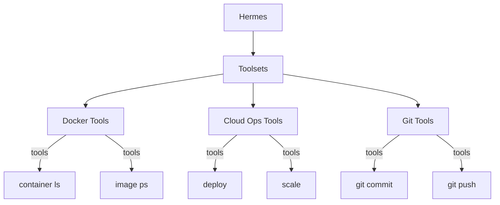

<picture>
  <source media="(prefers-color-scheme: dark)" srcset="../resources/logos/hermes-howto-logo-dark.svg">
  
</picture>

# Toolsets

Toolsets are curated collections of related tools that can be enabled, disabled, or swapped as a unit. They provide a way to organize tool access by capability domain.

## Overview

Toolsets enable you to:

- **Group related tools** into logical collections (e.g., "docker-tools", "cloud-ops")
- **Enable/disable as a unit** — activate or deactivate entire capability sets
- **Swap tool providers** — switch between equivalent tool implementations
- **Manage permissions** — apply consistent tool access policies



## What You'll Learn

| | Topic | Description |
|---|-------|-------------|
| | [toolset-format.md](toolset-format.md) | Toolset configuration structure |
| | [toolset-examples/](toolset-examples/) | Ready-to-use toolset configurations |

## Key Concepts

### Toolset vs Individual Tools

| Aspect | Individual Tool | Toolset |
|--------|-----------------|---------|
| **Activation** | One at a time | Group activation |
| **Dependencies** | Manual tracking | Auto-resolved within set |
| **Configuration** | Per-tool | Per-toolset |
| **Provider switching** | Manual | Automatic |

### Toolset Structure

```
toolset-name/
├── TOOLSET.md          # Toolset manifest
└── tools/
    ├── tool-a.md       # Tool definitions
    └── tool-b.md
```

### Built-in Toolsets

| Toolset | Description |
|---------|-------------|
| **core** | Essential tools (file, search, terminal) |
| **git** | Version control operations |
| **docker** | Container management |
| **kubernetes** | K8s cluster operations |
| **cloud** | Cloud provider CLIs |

## Toolset Management

| Task | Command |
|------|---------|
| List toolsets | `toolset list` |
| Enable toolset | `toolset enable <name>` |
| Disable toolset | `toolset disable <name>` |
| Show tools | `toolset show <name>` |
| Validate | `toolset validate <path>` |

## File Locations

| Type | Location | Scope |
|------|---------|-------|
| **Project toolsets** | `.claude/toolsets/` | Current project |
| **User toolsets** | `~/.claude/toolsets/` | All projects |

## Verify Your Understanding

1. Run `/lesson-quiz toolsets` to test your knowledge
2. Review areas needing reinforcement
3. Proceed to next module

## Next Steps

- [toolset-format.md](toolset-format.md) — Configure your first toolset
- [toolset-examples/](toolset-examples/) — Example configurations
