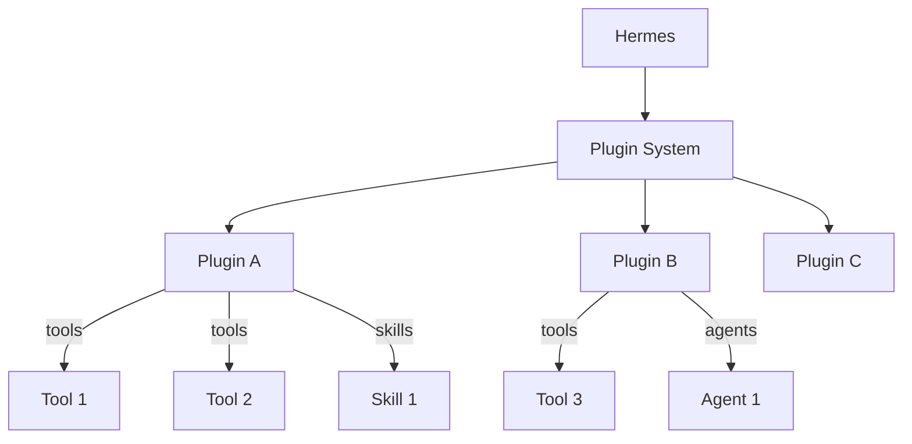

<picture>
  <source media="(prefers-color-scheme: dark)" srcset="../resources/logos/hermes-howto-logo-dark.svg">
  
</picture>

# Plugins

Plugins extend Hermes with custom functionality through structured packages that can include tools, skills, and agent configurations.

## Overview

Plugins enable you to:

- **Package capabilities** — Bundle tools, skills, and agents together
- **Share functionality** — Distribute reusable plugin packages
- **Enable/disable easily** — Toggle plugins without losing configuration
- **Version management** — Track and update plugin versions



## What You'll Learn

| | Topic | Description |
|---|-------|-------------|
| | [plugin-format.md](plugin-format.md) | Plugin package structure and manifest |
| | [plugin-examples/](plugin-examples/) | Example plugin implementations |

## Key Concepts

### Plugin vs Skill vs Toolset

| Component | Contents | Scope | Use Case |
|-----------|----------|-------|----------|
| **Plugin** | Tools + Skills + Agents | Feature packages | Complete capabilities |
| **Skill** | Instructions + Templates | Expertise | Domain-specific tasks |
| **Toolset** | Tool definitions | Tool collections | Related commands |

### Plugin Structure

```
my-plugin/
├── PLUGIN.md              # Plugin manifest
├── skills/
│   └── my-skill/
│       └── SKILL.md
├── tools/
│   └── my-tool.md
└── agents/
    └── my-agent.md
```

### Plugin Types

| Type | Description |
|------|-------------|
| **Built-in** | Ships with Hermes |
| **Community** | Shared via plugin registry |
| **Local** | Installed from local paths |
| **Remote** | Installed from git URLs |

## Plugin Management

| Task | Command |
|------|---------|
| List plugins | `plugin list` |
| Install | `plugin install <name>` |
| Uninstall | `plugin uninstall <name>` |
| Enable | `plugin enable <name>` |
| Disable | `plugin disable <name>` |
| Update | `plugin update <name>` |

## File Locations

| Type | Location | Scope |
|------|---------|-------|
| **Project plugins** | `.claude/plugins/` | Current project |
| **User plugins** | `~/.claude/plugins/` | All projects |

## Verify Your Understanding

1. Run `/lesson-quiz plugins` to test your knowledge
2. Review areas needing reinforcement
3. Proceed to next module

## Next Steps

- [plugin-format.md](plugin-format.md) — Create your first plugin
- [plugin-examples/](plugin-examples/) — Reference implementations
