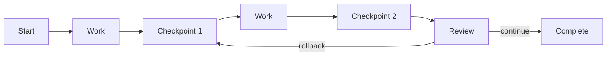

<picture>
  <source media="(prefers-color-scheme: dark)" srcset="../resources/logos/hermes-howto-logo-dark.svg">
  
</picture>

# Checkpoints

Checkpoints preserve conversation state at key moments, enabling recovery, branching, and review of work in progress.

## Overview

Checkpoints enable you to:

- **Save state** — Capture conversation context at any point
- **Recover work** — Resume from a specific checkpoint
- **Branch conversations** — Create alternate paths from saved states
- **Review progress** — Examine work done between checkpoints

## What You'll Learn

| | Topic | Description |
|---|-------|-------------|
| | [checkpoint-usage.md](checkpoint-usage.md) | Creating and managing checkpoints |
| | [checkpoint-examples/](checkpoint-examples/) | Example checkpoint workflows |

## Key Concepts

### Checkpoint vs Memory

| Feature | Checkpoint | Memory |
|---------|------------|--------|
| **Purpose** | State recovery | Context persistence |
| **Scope** | Point-in-time snapshot | Ongoing context |
| **Recovery** | Full restore | Selective retrieval |
| **Branching** | Creates alternatives | Single timeline |

### Checkpoint Contents

A checkpoint captures:
- Full conversation history
- File system state (modified files)
- Tool execution results
- Agent context and variables

### Checkpoint Types

| Type | Trigger | Retention |
|------|---------|-----------|
| **Manual** | User/agent request | Until explicitly deleted |
| **Auto** | Periodic or event | Configurable TTL |
| **Branch** | After branching | Preserved indefinitely |

## Checkpoint Management

| Task | Command |
|------|---------|
| Create checkpoint | `checkpoint create [name]` |
| List checkpoints | `checkpoint list` |
| Restore | `checkpoint restore <id>` |
| Branch | `checkpoint branch <id>` |
| Delete | `checkpoint delete <id>` |
| Export | `checkpoint export <id>` |

## File Locations

| Type | Location | Scope |
|------|---------|-------|
| **Project checkpoints** | `.claude/checkpoints/` | Current project |
| **User checkpoints** | `~/.claude/checkpoints/` | All projects |

## Verify Your Understanding

1. Run `/lesson-quiz checkpoints` to test your knowledge
2. Review areas needing reinforcement
3. Proceed to next module

## Next Steps

- [checkpoint-usage.md](checkpoint-usage.md) — Working with checkpoints
- [checkpoint-examples/](checkpoint-examples/) — Usage patterns
