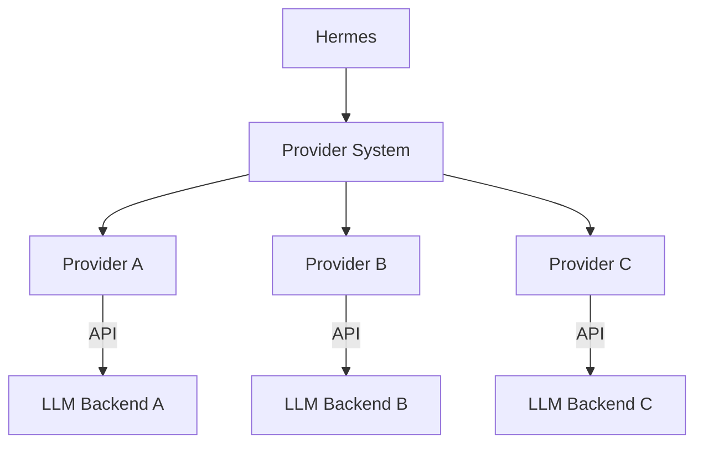

<picture>
  <source media="(prefers-color-scheme: dark)" srcset="../resources/logos/hermes-howto-logo-dark.svg">
  
</picture>

# Providers

Providers are backend services that power Hermes's AI capabilities. They enable flexible switching between different LLM backends.

## Overview

Providers enable you to:

- **Switch backends** — Use different LLM providers seamlessly
- **Configure credentials** — Manage API keys and authentication
- **Optimize costs** — Balance capability vs. cost across providers
- **Ensure reliability** — Configure fallbacks for provider outages

## What You'll Learn

| | Topic | Description |
|---|-------|-------------|
| | [provider-config.md](provider-config.md) | Provider configuration and setup |
| | [provider-examples/](provider-examples/) | Example configurations |

## Key Concepts

### Provider vs Model

| Aspect | Provider | Model |
|--------|----------|-------|
| **Scope** | Service provider | Specific model instance |
| **Examples** | Anthropic, OpenAI | Claude 3.5, GPT-4 |
| **Configuration** | API keys, endpoints | Temperature, max tokens |

### Provider Selection

| Use Case | Recommended Provider |
|----------|---------------------|
| **General coding** | Anthropic (Claude) |
| **Fast responses** | OpenAI (GPT-4o) |
| **Cost optimization** | Google (Gemini) |
| **Self-hosted** | Ollama, LocalAI |

### Provider Features

| Provider | Context Window | Multimodal | Function Calling |
|----------|---------------|------------|------------------|
| Anthropic | 200K | Yes | Yes |
| OpenAI | 128K | Yes | Yes |
| Google | 32K | Yes | Yes |
| Ollama | Varies | Varies | Limited |

## Provider Management

| Task | Command |
|------|---------|
| List providers | `provider list` |
| Show config | `provider show <name>` |
| Set default | `provider default <name>` |
| Test connection | `provider test <name>` |
| Add provider | `provider add <name>` |

## File Locations

| Type | Location | Scope |
|------|---------|-------|
| **Project providers** | `.claude/providers/` | Current project |
| **User providers** | `~/.claude/providers/` | All projects |

## Verify Your Understanding

1. Run `/lesson-quiz providers` to test your knowledge
2. Review areas needing reinforcement
3. Proceed to next module

## Next Steps

- [provider-config.md](provider-config.md) — Configure providers
- [provider-examples/](provider-examples/) — Setup examples
