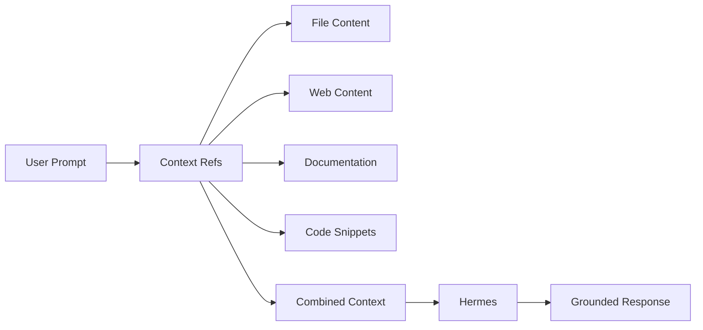

<picture>
  <source media="(prefers-color-scheme: dark)" srcset="../resources/logos/hermes-howto-logo-dark.svg">
  
</picture>

# Context Refs

Context refs enable referencing external content — files, URLs, documentation — directly within prompts for targeted, grounded responses.

## Overview

Context refs enable you to:

- **Ground responses** — Reference specific documentation or files
- **Reduce hallucination** — Provide authoritative source material
- **Target specific content** — Reference exact sections or functions
- **Chain references** — Combine multiple context sources

## What You'll Learn

| | Topic | Description |
|---|-------|-------------|
| | [context-ref-syntax.md](context-ref-syntax.md) | Reference syntax and patterns |
| | [context-ref-examples/](context-ref-examples/) | Reference usage examples |

## Key Concepts

### Context Ref vs Memory

| Feature | Context Ref | Memory |
|---------|-------------|--------|
| **Timing** | Per-prompt | Persistent |
| **Source** | Explicit reference | Always loaded |
| **Scope** | Specific content | Broad context |
| **Update** | Refresh per use | Stays current |

### Reference Types

| Type | Syntax | Use Case |
|------|--------|----------|
| **File** | `file://path/to/file` | Local source files |
| **URL** | `https://example.com` | Web content |
| **Section** | `file://path#L5-L15` | Specific lines |
| **Function** | `file://path#function-name` | Code definitions |
| **Documentation** | `docs://api/ref` | Internal docs |

## Context Ref Management

| Task | Command |
|------|---------|
| List refs | `ref list` |
| Add ref | `ref add <name> <target>` |
| Remove ref | `ref remove <name>` |
| Refresh | `ref refresh <name>` |
| Cache | `ref cache <name>` |

## File Locations

| Type | Location | Scope |
|------|---------|-------|
| **Project refs** | `.claude/refs/` | Current project |
| **User refs** | `~/.claude/refs/` | All projects |

## Verify Your Understanding

1. Run `/lesson-quiz context-refs` to test your knowledge
2. Review areas needing reinforcement
3. Proceed to next module

## Next Steps

- [context-ref-syntax.md](context-ref-syntax.md) — Reference syntax guide
- [context-ref-examples/](context-ref-examples/) — Usage patterns
