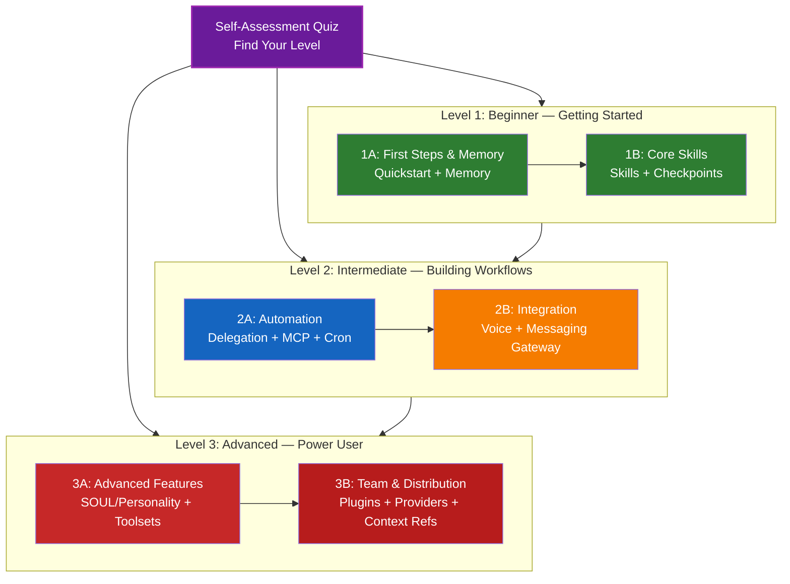

# Learning Roadmap

**New to Hermes Agent?** This guide helps you master Hermes Agent features at your own pace. Whether you're a complete beginner or an experienced developer, start with the self-assessment quiz below to find the right path for you.

---

## Find Your Level

Not everyone starts from the same place. Take this quick self-assessment to find the right entry point.

**Answer these questions honestly:**

- [ ] I can start Hermes Agent and have a conversation
- [ ] I have created or edited a HERMES.md file
- [ ] I have configured a skill
- [ ] I have delegated tasks to subagents
- [ ] I have configured an MCP server (e.g., GitHub, database)
- [ ] I have set up voice interaction
- [ ] I have configured a messaging gateway (Slack, Discord, etc.)
- [ ] I have set up scheduled tasks with cron

**Your Level:**

| Checks | Level | Start At | Time to Complete |
|--------|-------|----------|------------------|
| 0-2 | Level 1: Beginner — Getting Started | Milestone 1A | ~3 hours |
| 3-5 | Level 2: Intermediate — Building Workflows | Milestone 2A | ~5 hours |
| 6-8 | Level 3: Advanced — Power User & Team Lead | Milestone 3A | ~5 hours |

### Take the Assessment

To find your exact starting level, run:
```
/self-assessment
```

> **Tip**: If you're unsure, start one level lower. It's better to review familiar material quickly than to miss foundational concepts.

---

## Learning Philosophy

The folders in this repository are numbered in **recommended learning order** based on three key principles:

1. **Dependencies** - Foundational concepts come first
2. **Complexity** - Easier features before advanced ones
3. **Frequency of Use** - Most common features taught early

This approach ensures you build a solid foundation while gaining immediate productivity benefits.

---

## Your Learning Path



**Color Legend:**
- Purple: Self-Assessment Quiz
- Green: Level 1 — Beginner path
- Blue / Gold: Level 2 — Intermediate path
- Red: Level 3 — Advanced path

---

## Complete Roadmap Table

| Step | Feature | Complexity | Time | Level | Dependencies | Why Learn This | Key Benefits |
|------|---------|-----------|------|-------|--------------|----------------|--------------|
| 1 | Quickstart | Beginner | 30 min | Level 1 | None | Essential foundation | Get productive fast |
| 2 | Memory | Beginner+ | 45 min | Level 1 | None | Context persistence | Remember everything |
| 3 | Skills | Intermediate | 1 hour | Level 1 | Quickstart | Auto-invoked expertise | Reusable capabilities |
| 4 | Checkpoints | Intermediate | 45 min | Level 1 | Session management | Safe exploration | Experimentation, recovery |
| 5 | Delegation | Intermediate+ | 1.5 hours | Level 2 | Memory, Skills | Task distribution | Delegate to specialists |
| 6 | MCP | Intermediate+ | 1 hour | Level 2 | Configuration | Live data access | External integrations |
| 7 | Cron | Intermediate | 45 min | Level 2 | Basic concepts | Scheduled automation | Recurring tasks |
| 8 | Voice | Intermediate | 1 hour | Level 2 | Configuration | Hands-free interaction | Accessibility, speed |
| 9 | Messaging Gateway | Advanced | 1.5 hours | Level 2 | Voice basics | Multi-platform | Reach users everywhere |
| 10 | SOUL/Personality | Intermediate | 1 hour | Level 3 | All previous | Custom behavior | Brand voice, tone |
| 11 | Toolsets | Advanced | 1.5 hours | Level 3 | All previous | Extended capabilities | Specialized tools |
| 12 | Plugins | Advanced | 2 hours | Level 3 | All previous | Complete solutions | Team onboarding |
| 13 | Providers | Intermediate | 1 hour | Level 3 | Basic concepts | AI backend selection | Model flexibility |
| 14 | Context Refs | Advanced | 1 hour | Level 3 | All previous | Dynamic context | Smart injection |

**Total Learning Time**: ~11-13 hours (or jump to your level and save time)

---

## Level 1: Beginner — Getting Started

**For**: Users with 0-2 quiz checks
**Time**: ~3 hours
**Focus**: Immediate productivity, understanding fundamentals
**Outcome**: Comfortable daily user, ready for Level 2

---

### Milestone 1A: First Steps & Memory

**Topics**: Quickstart + Memory
**Time**: 1-2 hours
**Complexity**: Beginner
**Goal**: Get started with Hermes and set up persistent context

#### What You'll Achieve
- Start and configure Hermes Agent
- Set up project memory for team standards
- Configure personal preferences
- Understand how Hermes loads context automatically

#### Hands-on Exercises

```bash
# Exercise 1: Initial setup
# Follow 01-quickstart/setup.md to configure Hermes

# Exercise 2: Set up project memory
cp 02-memory/project-HERMES.md ./HERMES.md

# Exercise 3: Configure personal preferences
cp 02-memory/personal-HERMES.md ~/.hermes/HERMES.md

# Exercise 4: Try it out
# In Hermes Agent, interact and verify context persists
```

#### Success Criteria
- [ ] Successfully start Hermes Agent
- [ ] Hermes remembers your project standards from HERMES.md
- [ ] You understand when to use project vs. personal memory

#### Next Steps
Once comfortable, read:
- 01-quickstart/README.md
- 02-memory/README.md

---

### Milestone 1B: Core Skills

**Topics**: Skills + Checkpoints
**Time**: 1 hour
**Complexity**: Beginner+
**Goal**: Learn auto-invoked capabilities and safe experimentation

#### What You'll Achieve
- Install and configure skills
- Use checkpoints for safe experimentation
- Understand skill auto-invocation
- Create your first custom skill

#### Hands-on Exercises

```bash
# Exercise 1: Install a skill
cp -r 03-skills/code-review ~/.hermes/skills/

# Exercise 2: Try skill auto-invocation
# Ask Hermes to review some code
# Watch the skill activate automatically

# Exercise 3: Try checkpoint workflow
# Make some experimental changes
# Use /checkpoint to save state
# Experiment
# Use /rewind if needed
```

#### Success Criteria
- [ ] Skill automatically invoked when relevant
- [ ] Created and reverted to a checkpoint
- [ ] You understand skill auto-invocation vs. manual commands

#### Next Steps
- Read: 03-skills/README.md
- Read: 12-checkpoints/README.md
- **Ready for Level 2!** Proceed to Milestone 2A

---

## Level 2: Intermediate — Building Workflows

**For**: Users with 3-5 quiz checks
**Time**: ~5 hours
**Focus**: Automation, integration, task delegation
**Outcome**: Automated workflows, external integrations, ready for Level 3

---

### Prerequisites Check

Before starting Level 2, make sure you're comfortable with these Level 1 concepts:

- [ ] Can start and configure Hermes Agent (01-quickstart/)
- [ ] Have set up project memory via HERMES.md (02-memory/)
- [ ] Can install and use skills (03-skills/)
- [ ] Know how to create and restore checkpoints (12-checkpoints/)

> **Gaps?** Review the linked tutorials above before continuing.

---

### Milestone 2A: Automation (Delegation + MCP + Cron)

**Topics**: Delegation + MCP + Cron
**Time**: 2-3 hours
**Complexity**: Intermediate+
**Goal**: Automate complex workflows with delegation and external data

#### What You'll Achieve
- Delegate work to specialized agents
- Access live data from external sources via MCP
- Set up scheduled tasks with cron
- Build integrated workflows

#### Hands-on Exercises

```bash
# Exercise 1: Set up delegation
cp -r 04-delegation/* ~/.hermes/delegation/

# Exercise 2: Configure MCP
export GITHUB_TOKEN="***"
cp 05-mcp/github-mcp.json ~/.hermes/mcp.json

# Exercise 3: Set up cron
cp 08-cron/scheduled-tasks.json ~/.hermes/cron.json

# Exercise 4: Integration exercise
# 1. Use MCP to fetch data
# 2. Delegate analysis to a specialized agent
# 3. Schedule follow-up with cron
```

#### Success Criteria
- [ ] Successfully query external data via MCP
- [ ] Hermes delegates complex tasks to specialized agents
- [ ] Cron jobs execute on schedule
- [ ] Combined MCP + delegation + cron in a workflow

#### Next Steps
- Set up additional MCP servers
- Create custom delegation templates
- Read: 04-delegation/README.md
- Read: 05-mcp/README.md
- Read: 08-cron/README.md
- **Ready for Voice + Messaging!** Proceed to Milestone 2B

---

### Milestone 2B: Integration (Voice + Messaging Gateway)

**Topics**: Voice + Messaging Gateway
**Time**: 2-3 hours
**Complexity**: Intermediate
**Goal**: Add voice interaction and multi-platform messaging

#### What You'll Achieve
- Configure voice input and output
- Set up messaging platform integrations
- Route messages across channels
- Create voice-controlled workflows

#### Hands-on Exercises

```bash
# Exercise 1: Configure voice
cp 06-voice/voice-config.md ~/.hermes/voice.json

# Exercise 2: Set up messaging gateway
cp 07-messaging-gateway/slack-integration.md ~/.hermes/messaging/slack.json
cp 07-messaging-gateway/discord-integration.md ~/.hermes/messaging/discord.json

# Exercise 3: Configure channel routing
cp 07-messaging-gateway/channel-routing.md ~/.hermes/messaging/routing.json

# Exercise 4: Test voice command
# Say: "Check the status of the deployment"
```

#### Success Criteria
- [ ] Voice commands work reliably
- [ ] Messages flow through gateway correctly
- [ ] Channel routing works as configured
- [ ] Multi-platform messaging functional

#### Next Steps
- Customize voice settings for your needs
- Add more messaging platforms
- Read: 06-voice/README.md
- Read: 07-messaging-gateway/README.md
- **Ready for Level 3!** Proceed to Milestone 3A

---

## Level 3: Advanced — Power User & Team Lead

**For**: Users with 6-8 quiz checks
**Time**: ~5 hours
**Focus**: Team tooling, advanced customization, plugin development
**Outcome**: Power user, can set up team workflows and complex integrations

---

### Prerequisites Check

Before starting Level 3, make sure you're comfortable with these Level 2 concepts:

- [ ] Can delegate tasks to specialized agents (04-delegation/)
- [ ] Have set up MCP for external data (05-mcp/)
- [ ] Can configure scheduled tasks with cron (08-cron/)
- [ ] Have set up voice interaction (06-voice/)
- [ ] Can configure messaging gateway (07-messaging-gateway/)

> **Gaps?** Review the linked tutorials above before continuing.

---

### Milestone 3A: Advanced Features (SOUL/Personality + Toolsets)

**Topics**: SOUL/Personality + Toolsets
**Time**: 2-3 hours
**Complexity**: Advanced
**Goal**: Customize agent behavior and extend capabilities

#### What You'll Achieve
- Configure agent personality and tone
- Create custom behavior rules
- Build and deploy toolsets
- Customize SOUL for your brand

#### Hands-on Exercises

```bash
# Exercise 1: Configure personality
cp 09-soul-personality/personality-config.md ~/.hermes/personality.json

# Exercise 2: Customize tone
cp 09-soul-personality/tone-settings.md ~/.hermes/tone.json

# Exercise 3: Create custom personality
cp 09-soul-personality/custom-personality.md ~/.hermes/my-brand.json

# Exercise 4: Set up toolsets
cp 10-toolsets/web-tools.md ~/.hermes/toolsets/web.json
cp 10-toolsets/api-tools.md ~/.hermes/toolsets/api.json

# Exercise 5: Create custom toolset
# See 10-toolsets/custom-toolset.md
```

#### Success Criteria
- [ ] Personality configured to match your brand
- [ ] Custom behavior rules active
- [ ] Toolsets loaded and functional
- [ ] Custom toolset created

#### Next Steps
- Fine-tune personality based on feedback
- Build specialized toolsets for your domain
- Read: 09-soul-personality/README.md
- Read: 10-toolsets/README.md
- **Ready for Team & Distribution!** Proceed to Milestone 3B

---

### Milestone 3B: Team & Distribution (Plugins + Providers + Context Refs)

**Topics**: Plugins + Providers + Context Refs
**Time**: 2-3 hours
**Complexity**: Advanced
**Goal**: Build team tooling, create plugins, master multi-provider setup

#### What You'll Achieve
- Install and create complete bundled plugins
- Configure multiple AI providers with fallback
- Master context references for dynamic injection
- Build team tooling with plugins

#### Hands-on Exercises

```bash
# Exercise 1: Install a complete plugin
hermes plugin install pr-review

# Exercise 2: Configure multiple providers
cp 13-providers/multi-provider.md ~/.hermes/providers.json

# Exercise 3: Set up context refs
cp 14-context-refs/context-injection.md ~/.hermes/context-refs.json

# Exercise 4: Create custom plugin
# See 11-plugins/ for plugin structure

# Exercise 5: CI/CD integration
hermes -p "Review this code" --provider openai
hermes -p "Review this code" --provider anthropic
```

#### Success Criteria
- [ ] Installed and used a plugin
- [ ] Built or modified a plugin for your team
- [ ] Multi-provider setup with fallback working
- [ ] Context refs injecting dynamic data correctly
- [ ] Created a team-specific plugin

#### Next Steps
- Read: 11-plugins/README.md
- Read: 13-providers/README.md
- Read: 14-context-refs/README.md
- **Congratulations!** You've completed the full learning path.

---

## Quick Start: Jump to Your Level

### If you already know the basics...

| Your Level | Start Here | Skip To |
|------------|-----------|---------|
| New to Hermes | 01-quickstart/ | Start here |
| Know CLI basics | 03-skills/ | Skills |
| Used skills | 04-delegation/ | Delegation |
| Done delegation | 06-voice/ | Voice |
| Voice configured | 09-soul-personality/ | SOUL/Personality |
| Power user | 11-plugins/ | Plugins |

### If you want to learn a specific feature...

| Feature | Module | Time |
|---------|--------|------|
| Quick setup | 01-quickstart/ | 30 min |
| Memory | 02-memory/ | 45 min |
| Skills | 03-skills/ | 1 hour |
| Delegation | 04-delegation/ | 1.5 hours |
| MCP | 05-mcp/ | 1 hour |
| Voice | 06-voice/ | 1 hour |
| Messaging | 07-messaging-gateway/ | 1.5 hours |
| Cron | 08-cron/ | 45 min |
| Personality | 09-soul-personality/ | 1 hour |
| Toolsets | 10-toolsets/ | 1.5 hours |
| Plugins | 11-plugins/ | 2 hours |
| Checkpoints | 12-checkpoints/ | 45 min |
| Providers | 13-providers/ | 1 hour |
| Context Refs | 14-context-refs/ | 1 hour |

---

## Real-World Use Case Paths

### Customer Service Bot
1. Quickstart → Memory → Skills → Voice → Messaging Gateway → Plugins

### DevOps Automation
1. Quickstart → Memory → Delegation → MCP → Cron → Checkpoints

### Voice Assistant
1. Quickstart → Memory → Skills → Voice → SOUL/Personality → Toolsets

### Multi-Platform Integration
1. Quickstart → Memory → Messaging Gateway → Voice → Context Refs

### Team Collaboration Tool
1. Quickstart → Memory → Plugins → Delegation → Providers → Context Refs

---

## Assessment & Verification

After completing each milestone, verify your understanding:

### Level 1 Assessment
- [ ] Can start and configure Hermes Agent
- [ ] Memory persists across sessions
- [ ] Skills auto-invoke correctly
- [ ] Can create and restore checkpoints

### Level 2 Assessment
- [ ] Can delegate tasks effectively
- [ ] MCP integrations work
- [ ] Cron jobs execute on schedule
- [ ] Voice commands functional
- [ ] Messaging gateway routes correctly

### Level 3 Assessment
- [ ] Personality matches brand voice
- [ ] Toolsets extend capabilities
- [ ] Plugins install and work
- [ ] Multi-provider fallback works
- [ ] Context refs inject correctly
- [ ] Can create custom plugins

---

## Next Steps After Completion

Once you've completed the full learning path:

1. **Customize for your domain** - Adapt examples to your specific use case
2. **Share with your team** - Distribute plugins and configurations
3. **Contribute back** - Share improvements and new examples
4. **Stay current** - Check for updates with new Hermes releases

---

## Getting Help

If you get stuck:

1. Check the module's README.md for detailed documentation
2. Review QUICK_REFERENCE.md for common patterns
3. Run through the hands-on exercises again
4. Ask in the community forums
